[toc]


# numpy

> **学习目标**
>
> - Numpy创建多维数组和生成随机数的方法
> - 数组的索引与变换
> - Numpy中数组矩阵的运算及通用函数的基本使用方法
> - Numpy读写文件的方法和常用的统计分析函数

## 准备工作

```python
 显示所有变量
from IPython.core.interactiveshell import InteractiveShell
InteractiveShell.ast_node_interactivity = "all"
```

```python
 显示最后一个变量
from IPython.core.interactiveshell import InteractiveShell
InteractiveShell.ast_node_interactivity = "last_expr"
```

## numpy的数据类型

| 符号           | 含义                        |
| -------------- | --------------------------- |
| bool           | True和Flase                 |
| inti           | 支持int的32或64位           |
| int8           | 8位的整形(-128~127)         |
| int16          | -32768~32767                |
| int32          | -2 ** 31 ~ 2 ** 31 - 1      |
| int64          | -2 ** 63 ~ 2 ** 63 - 1      |
| uint8          | 8位的整形(0~255)            |
| uint16         | -32768~32767                |
| uint32         | 0 ~ 2 ** 32 - 1             |
| uint64         | 0 ~ 2 ** 64 - 1             |
| float16        | 1位符号位，5位指数位，10位  |
| float32        | 1位符号位，8位指数位，23位  |
| float64、float | 1位符号位，11位指数位，52位 |

> 上面的数字单位是位，例如int默认是4B=int32、float默认是8B=float64

**对于每种类型都有同名的转换函数可以将数据转为某种数据类型的数据。**

```python
import numpy as np
 34.5转为8位整形，即1字节
np.int8(34.5)
 34.5转为布尔值即True或Flase
np.bool(34.5)
```

而许多的NumPy下的函数有可选的参数dtype可以指定数据的类型，类型值。

```python
import numpy as np
np.arange(10, dtype=uint8)
n2=np.arange(7, dtype = 'u2')
n2.itemsize
n2.dtype
```

> ```
> 34
> ```
>
> ```
> True
> ```
>
> ```
> array([0, 1, 2, 3, 4, 5, 6, 7, 8, 9], dtype=uint8)
> ```
>
> ```
> 2
> ```
>
> ```python
> dtype('uint16')
> ```

## NumPy 数组对象 ndarray

> Python 提供了一个array 模块。array 和list 不同，它直接保存数值，和C 语言的一维 数组比较类似。但是由于Python 的array 模块不支持多维，也没有各种运算函数，因此也 不适合做数值运算。NumPy 的诞生弥补了这些不足。NumPy 提供了一种**存储单一数据类型 的多维数组——ndarray**。
>
> 注：**numpy只有两种类型，ndarray和ufunc**。
>
> > ufunc的特点：对整个数组进行操作
>
> numpy中维度称为轴，几维对应的就是几轴；**如二维数组，0轴就是指行，1轴就是指列，轴都是从0开始算的**

- ndarray 内部由以下内容组成：

  • 一个指向数据(内存或内存映射文件中的一块数据)的指针。

  • 数据类型或 dtype，描述在数组中的固定大小值的格子。

  • 一个表示数组形状(shape)的元组，表示各维度大小的元组。形状为(row×col)

-  **数据类型**
  numpy 支持的数据类型比 Python 内置的类型要多很多，基本上可以和C语言的数据类型对应上主要包括int8、int16、int32、int64、uint8、uint16、uint32、uint64、float16、float32、float64

## 创建数组对象

### 常用函数

| （np.）函数名 | 说明 | 例子 |
| ------ | ---- | ------ |
|**array(object[, dtype, copy, order, subok, ndmin])**|创建一个数组|n2=np.array([[1,2,3,4],[5,6,7,8],[5,6,7,8],[5,6,7,8]])|
|**arange(start[,stop,step])**|像range一样创建数组|**arange(1,10,2)**|
|**loadtxt(fname[, dtype,skiprows, delimiter,usecols,encoding …])**|从文本文件加载数据|peoples = np.loadtxt("data/人口.csv",skiprows=2,delimiter=',',usecols=(range(1,13)),encoding="utf-8")|
| ones(shape[, dtype, order])                                  | 返回给定形状和类型的新数组，并填充为1          | np.ones(100,int).reshape(4,25)                               |
| eye(N[, M, k, dtype, order])                                 | 返回一个二维数组，对角线上有一个，其他地方为零 | np.eye(4)=np.eye(4,4)                                        |
| zeros(shape[, dtype, order])                                 | 返回给定形状和类型的新数组，并用零填充         | np.zeros((2,3,4))                                            |
| diag(v[, k])                                                 | 提取对角线或构造对角线数组                     | np.diag([8,7,6,5])                                           |
| ndarray.T                                                    | 转置数组。                                     |                                                              |
| copy(a[, order])                                             | 返回给定对象的数组副本                         |                                                              |
| linspace(start,stop)                                         | 等差数列                                       | np.linspace(1,99)                                            |
| logspace(start,stop)                                         | 等比数列                                       |                                                              |

### 数组的常用属性

| （对象.)属性名    | 说明                   | 返回                                    |
| ----------------- | ---------------------- | --------------------------------------- |
| **对象.ndim**     | **返回数组的维度**     | **n维**                                 |
| **对象.shape**    | **返回数组结构**       | **(n,m)，几行几列，几个数就是几维**     |
| **对象.dtype**    | **返回数组类型**       | **dtype('data_type')，type的单位是bit** |
| **对象.size**     | **返回数组元素个数**   | **n个**                                 |
| **对象.itemsize** | **返回数组的元素大小** | **n个byte**                             |

> 修改属性的方式：对象.属性名=要修改的内容
>
> 如：a1.shape=4,2

### 数组的常用方法

| (对象名.)属性名() | 说明                                  | 例子            |
| ----------------- | ------------------------------------- | --------------- |
| **reshape()**     | 重新修改原数组的shape，不会修改原内容 | a2.reshape(4,2) |

> 方法的使用是对对象而言的，并不是第三方模块

### 生成随机数数组

**np模块下random函数下的方法**

| （np.random.）函数名                           | 说明                             | 返回                               |
| ---------------------------------------------- | -------------------------------- | ---------------------------------- |
| random(n)                                      | 生成n个[0-1)的小数               | np.random.random(10).reshape(2,5)  |
| rand(shape)                                    | 生成服从**均匀分布**的随机数数组 | np.random.rand(2,3,3)              |
| **randn**(shape)                               | 生成服从**正态分布**的随机数数组 | np.random.randn(3,2)               |
| **randint(left_range,right_range,size=shape)** | 生成给定上下限的随机整数数组     | np.random.randint(1,43,size=[2,5]) |
| seed()                                         | 随机数种子                       |                                    |

### 纯数学函数

NumPy里提供了很多的数学相关的函数，如下表所示：

| 函数                             | 说明                                                 |
| -------------------------------- | ---------------------------------------------------- |
| np.abs() np.fabs()               | 计算数组各元素的绝对值                               |
| np.sqrt()                        | 计算数组各元素的平方根                               |
| np.square()                      | 计算数组各元素的平方                                 |
| np.log(x),np.log10(x),np.log2(x) | 计算数组各元素的自然对数、10底对数和2底对数          |
| np.ceil(x),np.floor(x)           | 计算数组各元素的ceiling值或floor值                   |
| np.rint(x)                       | 计算数组各元素的四舍五入值                           |
| np.modf(x)                       | 将数据各元素的整数和小数部分以两个独立的数组形式返回 |
| np.cos/cosh/sin/sinh/tan/tanh    | 计算数据各元素的普通型和双典型的三角函数             |
| np.exp(x)                        | 计算数组各元素的指数值                               |

### numpy函数大全：

| 命令                                            | 说明                                               |
| ----------------------------------------------- | -------------------------------------------------- |
| sort()                                          | 排序**函数**，可以选择排序算法，**有返回值**       |
| a.sort()                                        | 排序**方法**，**无返回值**，原地操作               |
| asarray(a[, dtype, order])                      | 将输入转换为数组                                   |
| ravel(a[, order])                               | 返回一个连续的扁平数组。                           |
| rollaxis(a, axis[, start])                      | 向后滚动指定的轴，直到其位于给定的位置。           |
| swapaxes(a, axis1, axis2)                       | 互换数组的两个轴。                                 |
| diagflat(v[, k])                                | 使用展平的输入作为对角线创建二维数组               |
| tri(N[, M, k, dtype])                           | 在给定对角线处及以下且在其他位置为零的数组         |
| tril(m[, k])                                    | 数组的下三角                                       |
| triu(m[, k])                                    | 数组的上三角                                       |
| copyto(dst, src[, casting, where])              | 将值从一个数组复制到另一个数组，并根据需要进行广播 |
| zeros_like(a[, dtype, order, subok, shape])     | 返回形状与类型与给定数组相同的零数组。             |
| full(shape, fill_value[, dtype, order])         | 返回给定形状和类型的新数组，并用 fill_value 填充   |
| full_like(a, fill_value[, dtype, order, …])     | 返回形状和类型与给定数组相同的完整数组             |
| fromstring(string[, dtype, count, sep])         | 从字符串中的文本数据初始化的新一维数组             |
| ones_like(a[, dtype, order, subok, shape])      | 返回形状与类型与给定数组相同的数组                 |
| empty(shape[, dtype, order])                    | 返回给定形状和类型的新数组，而无需初始化条目       |
| empty_like(prototype[, dtype, order, subok, …]) | 返回形状和类型与给定数组相同的新数组               |
| identity(n[, dtype])                            | 返回标识数组                                       |
| transpose(a[, axes])                            | 排列数组的尺寸                                     |
| concatenate((a1, a2, …)                         | 沿现有轴连接一系列数组。                           |
| stack(arrays[, axis, out])                      | 沿新轴连接一系列数组。                             |
| column_stack(tup)                               | 将一维数组作为列堆叠到二维数组中。                 |
| dstack(tup)                                     | 沿深度方向（ 沿第三轴）按顺序堆叠数组。            |
| hstack(tup)                                     | 水平（ 按列）顺序堆叠数组。                        |
| vstack(tup)                                     | 垂直（ 行）按顺序堆叠数组。                        |
| block(arrays)                                   | 从块的嵌套列表中组装一个 nd 数组。                 |
| split(ary, indices_or_sections[, axis])         | 将数组拆分为多个子数组，作为 ary 的视图。          |
| array_split(ary, indices_or_sections[, axis])   | 将一个数组拆分为多个子数组。                       |
| dsplit(ary, indices_or_sections)                | 沿第 3 轴（ 深度）将数组拆分为多个子数组。         |
| **hsplit**(ary, indices_or_sections)            | **水平**（ 按列）将一个数组**拆分**为多个子数组。  |
| **vsplit**(ary, indices_or_sections)            | **垂直**（ 行）将数组**拆分**为多个子数组。        |
| delete(arr, obj[, axis])                        | 返回一个新的数组，该数组具有沿删除的轴的子数组。   |
| insert(arr, obj, values[, axis])                | 沿给定轴在给定索引之前插入值。                     |
| append(arr, values[, axis])                     | 将值附加到数组的末尾。                             |
| resize(a, new_shape)                            | 返回具有指定形状的新数组。                         |
| trim_zeross(filt[, trim])                       | 修剪一维数组或序列中的前导和 / 或尾随零。          |
| unique(ar[, return_index, return_inverse, …])   | 查找数组的唯一元素。                               |
| flip(m[, axis])                                 | 沿给定轴颠倒数组中元素的顺序。                     |
| fliplr(m)                                       | 左右翻转数组。                                     |
| flipud(m)                                       | 上下翻转阵列。                                     |
| roll(a, shift[, axis])                          | 沿给定轴滚动数组元素。                             |
| rot90(m[, k, axes])                             | 在轴指定的平面中将阵列旋转 90 度。                 |

## 索引访问数组

- 一维度

```python
a=np.arange(1,10)
整数作为下标访问，分别访问0和5
a[[0,5]]    #只能用列表，不能元组，访问了索引0和5的元素，共两个，而不是切片
步长为负数时，切片的开始下标必须大于结束下标（也可以不，只是没数据，不报错）
a[-1::-2]
```

- **二维度**

  **每个维度用逗号隔开**，而每一个维度里都可以使用切片，**只能省略第二个维度，不能省略第一个维度**

  ```python
  a2=np.arange(1,21).reshape(4,5)
  #二维数组只有一个下标索引代表行
  a2[1]
  #索引访问第0行的第3和第4列
  a2[0,3:]
  #索引第2和第3行的3-4列
  a2[2:,3:]
  #索引第2列
  a2[:,2:3]
  #从两个序列对应位置取出整数组成下标索引
  a2[0:3,1:4]
  a2[[0,1,2],[1,2,0]]  #错误的：a2[[0,1,2],[1,2]]
  #索引第2，4行中的第0，2，3列（不连续的列使用元组表示）
  a2[2:5:2,(0,1,2)]
  ```

- 用布尔数组来索引

  ```python
  a2=np.arange(1,21).reshape(4,5)
  a2[[True,False,True,False],2:4]  #等价于a2[[::2],2:4]
  ```
  
  > **布尔索引常用函数**
  >
  > | 命令                                         | 说明                                                    | 例子                                                         |
  > | -------------------------------------------- | ------------------------------------------------------- | ------------------------------------------------------------ |
  > | **np.any([condition1,condition2..],axis=0)** | 返回任意符合条件的行                                    | **peoples[np.any([province=="河北",province=="山西",province=="内蒙古"],axis=0)]** |
  > | **np.all([condition1,condition2..],axis=0)** | 同理，**都必须加上axis=0**                              |                                                              |
  > | \|                                           | 或操作，多个相当于any                                   | np.where((province=="北京")                                  |
  > | &                                            | 与                                                      |                                                              |
  > | **np.where(condition)[0]**                   | 返回符合条件的索引的ndarray类型，可以直接用这个进行索引 | peoples[[np.where(province=="北京")[0],np.where(province=="天津")[0]]] |
  > |                                              |                                                         |                                                              |


- 花式索引

  ```python
  # 首先，你将有一个原始的NumPy数组，假设它是这样创建的：
  arr = np.array([[1, 2, 3, 4], 
                  [3, 4, 5, 6], 
                  [5, 6, 7, 8]])
  # 接着，要得到你想要的2x2数组，你可以这样做：
  arr[:,(1,3)][(0,2),:]
  arr[(0,2),:][:,(1,3)]
  #错误答案
  #arr[[0,2],[1,3]]
  #arr[(0,2),(1,3)]
  ```

  > 前两个操作用的索引访问都没用多个[]包起来，所以都是先访问了索引了一部分，之后再一次用索引到最后结果，相当于用了两次索引
  >
  > 后两个就是只索引一次，分别是索引（0，1）和（1，3）这两个元素

- 案例

  ```python
  # 从文本文件读取人口数据
  peoples = np.loadtxt("data/人口.csv",skiprows=2,delimiter=',',usecols=(range(1,13)),encoding="utf-8")
  province = np.loadtxt("data/人口.csv",skiprows=2,delimiter=',',usecols=0,encoding="utf-8",dtype=str)
  province
  
  # 读取北京的数据
  peoples[0]
  # 读取上海的人口数据
  flag=province=="上海"
  peoples[flag]
  #peoples[True]  #等价于peoples
  
  
  # 读取上海1994年的人口数据
  peoples[province=="上海",4]
  
  
  # 读取北京、上海、广东所有年份的人口数据
  f1=province=="上海"
  f2=province=="北京"
  f3=province=="广东"
  f4=f1+f2+f3
  f4
  peoples[f4]
  
  
  # 读取北京、上海、广东1993到2000年的数据
  peoples[f4,3:11]
  
  
  # 读取北京1991年、上海1994年，广东1995年的数据
  peoples[(0,8,18),(1,4,5)]
  
  
  #读取北京、上海，广东1991年、1994年、1995年的数据
  peoples[[[0],[8],[18]],(1,4,5)]
  peoples[[0,8,18],[[1,4,5],[1,4,5],[1,4,5]]]
  peoples[np.ix_([0,8,18],[1,4,5])]
  ```

  

## 数组的广播机制

广播机制是Numpy让两个不同shape的数组能够做一些运算，需要对参与运算的两个数组做一些处理或者说扩展，最终是参与运算的两个数组的shape一样，然后广播计算(对应位置数据进行某运算)得到结果。


广播机制首先需要判断参与计算的两个数组能否被广播机制处理？即判断是否广播兼容，**广播机制规则是，比较两个数组的shape，从shape的尾部开始一一比对。**

- (1). 如果**两个数组的维度相同，对应位置上轴的长度相同或其中一个的轴长度为1，则广播兼容**，可在轴长度为1的轴上进行广播机制处理。
- (2). 如果两个数组的维度不同，那么给低维度的数组**前扩展**提升一维，扩展维的轴长度为1,然后在扩展出的维上进行广播机制处理。

> 两数组有行相同或列相同或有一个数组只有一行或一列的元素应该就可以

- 广播机制与布尔数组的应用

  ```python
  a2=np.arange(1,21).reshape(4,5)
  a2>5  #广播机制，返回的shape不变，条件真就是true,否则False
  
  #用广播机制得出的布尔数组来做索引
  index= a2 % 2 == 0
  a2[index]
  ```


## 变换数组的形态

- 方法

  | 对象.方法名() | 说明               | 例子                                  |
  | ------------- | ------------------ | ------------------------------------- |
  | a.ravel()     | 展平数组，展成1行  |                                       |
  | a.flatten()   | 按行（列）展平     | 展行a1.flatten()；展列a1.flatten("F") |
  | a.repear()    | 按行（列）重复几次 | a.repeat(3,axis=1)                    |

- 函数

  | np.函数名()         | 说明                                         | 例子                                                         |
  | ------------------- | -------------------------------------------- | ------------------------------------------------------------ |
  | np.ravel()          | 展平数组，展成1行                            | a.ravel()                                                    |
  | np.flatten()        | 按行（列）展平                               | 展行a1.flatten()；展列a1.flatten("F")                        |
  | np.hstack()         | 将两个数组横向组合                           | np.hstack((a2,a3))                                           |
  | np.vstack()         | 将两个数组纵向组合                           | np.vstack((a2,a3))                                           |
  | np.concatenate()    | 横向或纵向合并数组，axis=1横向，0纵向，默认0 | np.concatenate((a2,a3),axis=1)                               |
  | np.hsplit()         | 横向分割                                     | np.hsplit(a,4) #平分四分<br/>np.hsplit(a,[1,3])#第一份1行，第二份2行 |
  | np.vsplit()         | 同上理                                       |                                                              |
  | np.tile(arr，shape) | 按arr重复shape个                             | np.tile(a,(2,3))  #2行3列                                    |
  

## numpy矩阵

> array类型没法直接使用矩阵的运算，但可以用矩阵的函数，传递array
>
> 用matrix函数转换成矩阵类型

```python
a1=np.array([[1,2,3],[4,5,6]])
a2=np.array([[1,3],[5,7],[9,11]])
# a1*a2  目前是数组，没法直接用矩阵的乘法运算
np.dot(a1,a2)

#matrix函数将数组转成矩阵matrix类型
m1=np.matrix(a1)
m1
m2=np.matrix(a2);m2
m1*m2
```

## ufunc类型（函数）

> 是对整个数组进行操作的

```python
#代码2-34：数组的四则运算
#创建两个一维数组x和y
x=np.array([1,2,3])
y=np.array([4,5,6])
#数组相加
x+y
np.add(x,y)  #通用函数
#数组相减
x-y
np.subtract(x,y)
#数组相乘
x*y
np.multiply(x,y)
#数组相除
x/y
np.divide(x,y)
#数组幂运算
x**y
np.power(x,y)


#代码2-35：数组的比较运算
#>,<,==,>=,<=,!=
x=np.array([4,2,3])
y=np.array([1,2,6])
x;y

x<y

x>y

x==y
np.equal(x,y)

x>=y

x!=y
np.not_equal(x,y)

x[x>y]
```

## 读写文件

```python
#代码2-39：二进制存储数据
a=np.arange(100).reshape(10,-1)
#使用save保存数组到文件
np.save("./data/save_a1",a)

#代码2-40：多个数组的存储
a=np.arange(9).reshape(3,3)
a1=np.arange(0,1,0.01)
#使用savez保存多个数组到文件（文件后缀名为npz）
np.savez("./data/save_arrs",x=a,y=a1)  #x,y随便的，相当于命名

#代码2-41：二进制读取文件
#读取单个数组的文件
load_a1=np.load("./data/save_a1.npy")
load_a1
#读取多个数组的文件（npz：多个数组文件）
load_arrs=np.load("./data/save_arrs.npz")
load_arrs.files
x1=load_arrs['x']  #通过类似字典的方式去访问
y1=load_arrs[load_arrs.files[1]]
x1;y1


#代码2-42：文本文件的存储与读取
a=np.arange(0,20,0.5).reshape(5,8)
#存储文本文件savetxt
np.savetxt("./data/save_txt",a,delimiter=",")
#读取文本文件loadtxt
b=np.loadtxt("./data/save_txt",delimiter=",")


#代码2-43：使用genfromtxt函数读取数据
np.genfromtxt("./data/save_txt",delimiter=",",skip_header=1)  #跳过一行
```

## 排序

| 命令                 | 说明                                 | 例子              |
| -------------------- | ------------------------------------ | ----------------- |
| sort()               | 排序函数，可以选择排序算法，有返回值 | np.sort(asix=1)   |
| **a.sort()**         | **排序方法，无返回值，原地操作**     | a.sort(asix=0)    |
| a.argsort()          | argument，排序后的原始下标           | a.argsort(axis=0) |
| np.lexsort(md_array) | 间接排序                             |                   |

```python
#lexsort：间接排序
name=np.array(['jb','lis','wa','liu','wa'])
age=np.array([41,24,53,74,51])
name;age
i1=np.lexsort((name,age))  #两个数组是对应的，因此一个排序另一个也要排序，默认先按后面的排，即按照age排
i2=np.lexsort((age,name))  #先按name排，相等再按age排
i1;i2

#lexsort应用
[(name[i],age[i])for i in i1]   #列表解析式，可以重复
dict(zip(name[i1],age[i1]))  #字典，但不能重复
np.vstack((name[i1],age[i1]))
#name排
[(name[i],age[i])for i in i2]   #列表解析式，可以重复
dict(zip(name[i2],age[i2]))  #字典，但不能重复
```

> **带arg函数的是重点，可以实现索引的高级操作**

## 统计函数

```python
#代码2-47：数组内去重
#创建字符串数组
name=np.array(['jb','lis','wa','liu','wa'])
np.unique(name)
#数组去重
name
set(name)
#不用Numpy的实现

#创建整型数组
a4=np.random.randint(1,5,size=10)
a4
#整型数组去重
np.unique(a4)


#代码2-50：Numpy中常用统计函数
#创建二维数组
a=np.arange(30).reshape(5,6)
a
#数组的和
a.sum()
#沿横轴的和(行的和)
a.sum(axis=1)
#沿纵轴的和（列的和）
a.sum(axis=0)
#数组均值
a.mean()
#沿横轴均值
a.mean(axis=1)
#沿纵轴均值
a.mean(axis=0)
#标准差和方差
a.std()
#最大值和最小值
a.max();a.min()
#最大值和最小值的索引（重点）
a.argmax();a.argmin()


#代码2-51：cumsum和cumprod
#创建数组

#累计和
a
np.cumsum(a,axis=0)
#累计积

```

## 案例

```python
# 1990年全国人口总和
peoples[:,0].sum()
# 2001年全国人口总和
p01=peoples[:,11]
p01.sum()
# 2001年各省市人口的均值和标准差
p01.mean()
p01.std()
# 广东1990年的人口
peoples[province=="广东",0]
# 广东每年人口增长值
np.diff(peoples[province=="广东"])
# 东北三省1990年人口之和
three=peoples[np.any([province=="辽宁",province=="吉林",province=="黑龙江 "],axis=0)]
np.sum(three[:,0])
# 东北三省2001年人口之和
np.sum(three[:,11])
# 东北三省每年人口增长值
np.diff(peoples[np.any([province=="辽宁",province=="吉林",province=="黑龙江 "],axis=0)])
# 各个省历年人口之和
np.sum(peoples,axis=0)
# 1990年人口最多的省份
province[np.argmax(peoples[:,0])]
# 2001年人口最多的省份
province[np.argmax(peoples[:,11])]
# 2001年人口最少的省份
province[np.argmin(peoples[:,11])]
```


# matplotlib

## matplotlib准备工作

```python
#导入
import numpy as np
import matplotlib.pyplot as plt
import pandas as pd
# 设置中文显示
plt.rcParams["font.sans-serif"] = "SimHei"
plt.rcParams["axes.unicode_minus"] = False
```

- 子图的间距

```python
plt.tight_layout()
<Figure size 432x288 with 0 Axes>
```

```python
import pandas as pd
df = pd.read_csv("data/Euro2012.csv")
df.head()
```

- matplotlib的所有配置参数的字典

  ```python
  plt.rcParams
  # plt.rcdefaults()   #将rc参数恢复默认设置
  
  # 修改线型
  plt.rcParams["lines.linestyle"]="--"
  # 修改线宽
  plt.rcParams["lines.linewidth"]=3
  
  
  print(plt.style.available)  #打印所有风格
  plt.style.use("bmh")  #设置风格的函数
  ```

- 支持的图片格式

  ```python
  plt.figure().canvas.get_supported_filetypes()
  ```

  

## 基本语法

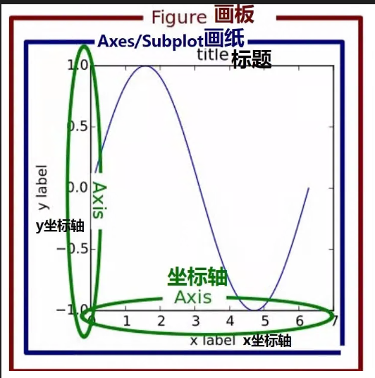

- plt.figure：创建空白画布，在一幅图中可省略
- figure.add_subplot：第一个参数表示行，第二个参数表示列，第三个参数表示选中的子图编号
- plt.title：标题
- plt.xlabel：x轴名称
- plt.ylabel：y轴名称
- plt.xlim：x轴的范围
- plt.ylim：y轴范围
- plt.xticks：第一个参数为范围，数组类型；第二个参数是标签，第三个是控制标签
- plt.yticks：同plt.xticks
- plt.legend：图例
- plt.savafig：保存图形
- plt.show：在本机显示
> **上述都是函数，都要加括号**

```python
# 代码 3-2
# 生成数据
rad=np.arange(0,np.pi*2,0.01)


# 第一幅子图
# 确定画布大小
fig=plt.figure(figsize=(8,6),dpi=80,facecolor="cyan")
# 创建一个两行1列的子图，并开始绘制第一幅，用对象的add_subplot方法
ax1=fig.add_subplot(2,1,1)
# 添加标题
plt.title("子图示例1")
# 添加x轴的名称
plt.xlabel("x")
# 添加y轴的名称
plt.ylabel("y")
# 确定x轴范围
plt.xlim([0,1])
# 确定y轴范围
plt.ylim([0,1])
# 规定x轴刻度
plt.xticks([0,0.5,2])  #可以不均匀，权限大于范围lim
# 确定y轴刻度
plt.yticks(np.arange(0,1.1,0.1))
# 添加y=x^2曲线
plt.plot(rad,rad**2,label="$y=x^2$")  #可以省去x，只剩y
# 添加y=x^4曲线
plt.plot(rad,rad**4,label="$y=x^4$")
# 添加图例
plt.legend()
"""以上代码只针对与第一子图"""


# 第二幅子图
# 开始绘制第2幅
fig.add_subplot(2,1,2)  #一旦开始声明一个子图，那么接下来操作只针对该子图
# 添加标题
plt.title("sin/cos")
# 添加x轴的名称
plt.xlabel("radius")
# 添加y轴的名称
plt.ylabel("value")
# 确定x轴范围
plt.xlim(0,np.pi*2)
# 确定y轴范围
plt.ylim(-1,1)
# 规定x轴刻度
plt.xticks([0,np.pi/2,np.pi,np.pi*1.5,np.pi*2])
# 确定y轴刻度
plt.yticks([-1,-0.5,0,0.5,1])
# 添加sin曲线
plt.plot(rad,np.sin(rad),label="$y=sinx$")
# 添加cos曲线
plt.plot(rad,np.cos(rad),label="$y=cos(x)$")
# 添加图例
plt.legend()
# 保存图形到文件
plt.savefig("./data/")
# 调整图形
plt.subplots_adjust(hspace=0.3,wspace=0)  #调整高度间隔
# 显示图形
plt.show()
```

> 以上方式都必须只能针对当前的子图设置，不能对任意的子图进行设置，下面的方式可以在任意位置设置子图：
>
> 采用 对象.方法（）的方式，直接对某个子图对象进行操作
>
> - plt.xlabel() → ax.set_xlabel()
> - plt.ylabel() → ax.set_ylabel()
> - plt.xlim() → ax.set_xlim()
> - plt.ylim() → ax.set_ylim()
> - plt.title() → ax.set_title()  

### xticks的特殊用法

```python
plt.xticks(range(0,12,2),range(1990,2002,2)) #第一个参数表示底下有12个刻度，用的是索引表示，取0.2.4...10的刻度；第二个参数表示第一个显示出来的刻度对应的真实的值，表示0索引对应1990,2索引对应1992，这是真实的，从1开始，不是索引表示
```

## 子图的绘制

### add_subplot方法

```python
fig=plt.figure(figsize=(8,8))

x=np.arange(-10,10)
x
fig.add_subplot(221)#表示两行两列，第一幅图
plt.plot(x,x)
plt.title("$y=x$")

fig.add_subplot(222)
plt.plot(x,x**2)
plt.title("$y=x^2$")

# plt.add_subplot(223)  #报错，因为得按顺序
fig.add_subplot(223)
plt.plot(x,x**3)
plt.title("$y=x^3$")

fig.add_subplot(224)
plt.plot(x,x**4)
plt.title("$y=x^4$")

plt.suptitle("画布的总标题")
plt.subplots_adjust(hspace=0.4,wspace=0.3)


# 面向对象的add_subplot
fig=plt.figure(figsize=(8,8))

ax1=fig.add_subplot(221)
ax2=fig.add_subplot(222)
ax3=fig.add_subplot(212)  #ax3占两个，表示两行，此时变成一列，取第二行整行

ax2.plot(x,x**2)
ax1.plot(x,x)
ax3.plot(x,x)
ax2.set_title("$y=x^2$")
ax2.set_xlabel("x")
plt.show()
```

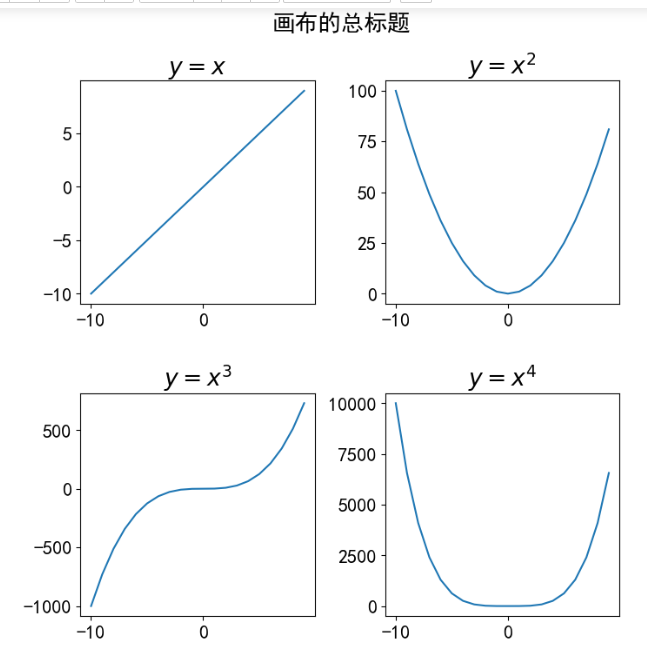

### subplot函数

```python
fig=plt.figure(figsize=(8,8))
x=np.arange(-10,11)
plt.subplot(221)
plt.plot(x,x)
#获取当前子图
ax1=plt.gca()

plt.subplot(222)
plt.plot(x,x**2)
plt.title("$y=x^2$")

plt.subplot(212)
plt.plot(x,x**3)

ax1.set_title("$y=x$")
plt.show()
```


### subplots函数（配合pd好用）

```python
plt.style.use("seaborn-whitegrid")
x=np.arange(-10,11)
#subplots返回值两个
fig,ax=plt.subplots(2,2,figsize=(8,8),sharex=True)#即使还没画图，位置也会先加载出来
ax[0,0].plot(x,x)
ax[0,1].plot(x,x**2)
ax[1,0].plot(x,x**3)
ax[1,1].plot(x,x**4)
#面向对象标题label这些都是set_...
ax[1,1].set_title("$y=x^4$")
plt.subplots_adjust(hspace=0.1)
plt.show()


#另一种使用方式
plt.style.use("seaborn-whitegrid")
x=np.arange(-10,11)
fig,((ax1,ax2),(ax3,ax4))=plt.subplots(2,2,figsize=(8,8),sharex=True)
ax1.plot(x,x)
ax2.plot(x,x)
ax3.plot(x,x)
ax4.plot(x,x)
```


### subplot2grid函数（推荐）

**plt.subplot2grid((shape),(loc),colspan=,rowspan=)**

```python
#2表两维
x=np.arange(-10,11)
plt.figure(figsize=(8,8))
plt.subplot2grid((2,2),(0,0))#第一个是shape，第二个是loc，现在表示0,0，即第一个
plt.plot(x,x)

plt.subplot2grid((2,2),(0,1))
plt.plot(x,x)

plt.subplot2grid((2,2),(1,0),colspan=2)
plt.plot(x,x)
```


### GridSpec函数配合subplot函数

> 也可以考虑

```python
x=np.arange(-10,11)
plt.style.use("seaborn-whitegrid")
plt.figure(figsize=(8,8))

grid=plt.GridSpec(2,2)

plt.subplot(grid[0,0])
plt.plot(x,x)
plt.subplot(grid[0,1])
plt.plot(x,x)
plt.subplot(grid[1,0:2])  #用切片的方式
plt.plot(x,x)

plt.show()
```


## 曲线图

```python
# 从文本文件读取人口数据
peoples=np.loadtxt("data/人口.csv",skiprows=2,delimiter=",",usecols=(range(1,13)),encoding="utf-8")
province=np.loadtxt("data/人口.csv",skiprows=2,delimiter=",",usecols=(0),encoding="utf-8",dtype=str)
province

# 生成画布并设置大小
fig=plt.figure(figsize=(6,4))

# 绘制北京人口1990-2001年的折线图
beijing_y = peoples[0]
beijing_y
plt.plot(beijing_y,label=province[0],marker='*',color='g')

# 绘制上海人口1990-2001年的折线图
# print(np.where(province=="上海")[0])
plt.plot(peoples[8],label="上海",marker='.',color='b')

# 绘制广东人口1990-2001年的折线图
plt.plot(peoples[18],label="广东",marker='+',color='r')

# 设置各种参数
plt.title("北京、上海、广东人口折线图")
plt.legend(title="省市图例",loc="center left")
plt.xticks(range(0,12,2),range(1990,2002,2))
plt.axis([0,12,500,8000])
plt.show()
```

## 散点图

**plt.scatter(x, y, s, c, marker, cmap, norm, alpha, linewidths, edgecolorsl)**

- 参数说明：
    - x: x轴数据，不能像折线图一样省略
    - y: y轴数据
    - s: 散点大小
    - c: 散点颜色
    - marker: 散点图形状
    - cmap: 指定某个colormap值,该参数一般不用，用默认值
    - alpha: 散点的透明度
    - linewidths: 散点边界线的宽度
    - edgecolors: 设置散点边界线的颜色

```python
# 代码 3-6  第二季度，三大产业 散点图
data=np.load("./data/国民经济核算季度数据.npz",allow_pickle=True)
name=data['columns']
values=data['values']
name
values[0]
# 设置画布
fig=plt.figure(figsize=(6,4))
%matplotlib inline
# 绘制散点1 第二季度 第一产业
plt.scatter(values[1:69:4,0],values[1:69:4,3],marker='o',color="g",label=name[3])  #第一个values的列可以选数字列0，1，然后后面再设置xtick设置value实际的值
# 绘制散点2 第二产业
plt.scatter(values[1:69:4,0],values[1:69:4,4],marker='o',color="r",label=name[4])
# 绘制散点3 第三产业
plt.scatter(values[1:69:4,0],values[1:69:4,5],marker='o',color="b",label=name[5])  #label就是用来设置图例的

# 添加横轴标
plt.xlabel("时间（第二季度）")
# 添加纵轴标签
plt.ylabel("三大产业生产总值")
# 设置x轴刻度
plt.xticks(range(2,70,4),values[1:69:4,1],rotation=30)  #第一个是x真正的取值，第二个是索引，第一个可以对应上面plot.scatter的选取的数字列
# 添加图表标题
plt.title("三大产业第二季度国民生产总值散点图")
# 添加图例
plt.legend()
# 保存图形到文件

# 显示图形
plt.show()
```

## 折线图

plt.plot(x, y, linestyle, linewidth,color,marker, markersize, markeredgecolor, - markerfactcolor, label, alpha)
- x：指定折线图的x轴数据；
- y：指定折线图的y轴数据；
- linestyle：指定折线的类型，可以是实线、虚线、点虚线、点点线等，默认文实线；
- linewidth：指定折线的宽度
- marker：可以为折线图添加点，该参数是设置点的形状；
- markersize：设置点的大小；
- markeredgecolor：设置点的边框色；
- markerfactcolor：设置点的填充色；
- label：为折线图添加标签，类似于图例的作用

```python
# 代码 3-7
# 读入数据
data=np.load("./data/国民经济核算季度数据.npz",allow_pickle=True)
name=data['columns']
values=data['values']
name
values[0]
# 设置画布
fig=plt.figure(figsize=(8,4))
# 绘制折线图
plt.plot(values[0:69,1],values[0:69,3],c="r",ls="--",lw=2,marker="D")
# 添加横轴标签
plt.xlabel("时间）")
# 添加y轴名称
plt.ylabel("生产总值")
# 设置x轴刻度
plt.xticks()
# 添加图表标题
plt.title("三大产业国民生产总值折线图")
# 保存图形到文件

# 显示图形
plt.show()
```

## 条形图

- 调用方法：**plt.bar(x, y, width，,height, color, edgecolor, bottom, linewidth, align, tick_label, align)**

    > 横向：plt.barh

- 参数说明：

    - **x：指定x轴上数值**
    - **y：指定y轴上的数值**
    - width：表示条形图的宽度，取值在0~1之间，默认为0.8。选定**y时，指定width为宽度，而此时height指的是高度0-1**
    - height：当选**x时，指定height为高度，而此时width指的是宽度0-1**
    - color：条形图的填充色
    - edgecolor：条形图的边框颜色
    - bottom：y轴的基准,默认0
    - linewidth：条形图边框宽度
    - tick_label：条形图的刻度标签
    - align：指定x轴上对齐方式，“center”,"lege"边缘

    ```python
    # 条形图举例（注意：不是直方图）
    label=['一班','二班','三班','四班']
    y=[38,40,42,45]
    plt.bar(x=label,height=y,width=0.7,color='g')   #条形图这里不叫y了叫height，width指每一条占的百分比
    plt.show()
    
    
    
    # 补充：横向条形图
    import numpy as np
    import matplotlib.pyplot as plt
    label=['2016','2017','2018','2019','2020']
    n=[20,30,25,15,40]
    x=range(len(n))
    # plt.barh(y=x,width=n,height=0.6,color='g') 
    plt.barh(y=label,width=n,height=0.6,color='g') 
    plt.title("公司销量条形图")
    plt.ylabel("年份")
    plt.xlabel("销量")
    # plt.yticks(x,label)
    plt.yticks(x,['2016年','2017年','2018年','2019年','2020年'])
    plt.show()
    ```

    

    

- 并列条形图

    ```python
    #补充 并列条形图：使x的位置错开
    label=['2016','2017','2018','2019','2020']
    n1=[20,30,25,15,40]
    n2=[40,60,43,10,73]
    x=np.arange(len(n1))
    w=0.4
    plt.figure(figsize=(6,4))
    
    plt.bar(x=x,height=n1,width=w,color='g',label="部门一")  #表示x宽度是w=0.4
    plt.bar(x=x+w,height=n2,width=w,color='r',label="部门二")    #x+w表示右移0.4
    
    plt.xticks(x+w/2,label)
    plt.legend()
    plt.title("并列条形图")
    plt.show()
    ```

    

- 堆叠条形图

    ```python
    #补充 堆叠条形图：其中一个用bottom
    label=['2016','2017','2018','2019','2020']
    n1=[20,30,25,15,40]
    n2=[40,60,43,10,53]
    x=np.arange(len(n1))
    w=0.7
    plt.bar(x=x,height=n1,width=w,label="部门一",color='r')
    plt.bar(x=x,height=n2,width=w,label="部门二",color='g',bottom=n1)
    
    plt.xticks(x,label)
    plt.legend()
    plt.show()
    ```

    

## 饼图

- 调用方法：**plt.pie(x, explode=None, labels=None, colors=None, autopct=None, pctdistance=0.6, shadow=False, labeldistance=1.1, startangle=None, radius=None, counterclock=True, wedgeprops=None, textprops=None, center=(0, 0), frame=False)**
- 参数说明：
    - **x：指定绘图的数据**
    - explode：指定饼图某些部分的突出显示，即呈现爆炸式
    - **labels：为饼图添加标签说明，类似于图例说明**
    - colors：指定饼图的填充色
    - autopct：自动添加百分比显示，可以采用格式化的方法显示  #auto percent
    - pctdistance：设置百分比标签与圆心的距离
    - shadow：是否添加饼图的阴影效果
    - labeldistance：设置各扇形标签（图例）与圆心的距离；
    - startangle：设置饼图的初始摆放角度；
    - radius：设置饼图的半径大小；
    - counterclock：是否让饼图按逆时针顺序呈现；  #默认
    - wedgeprops：设置饼图内外边界的属性，如边界线的粗细、颜色等；
    - textprops：设置饼图中文本的属性，如字体大小、颜色等； #text proportions
    - center：指定饼图的中心点位置，默认为原点
    - frame：是否要显示饼图背后的图框，如果设置为True的话，需要同时控制图框x轴、y轴的范围和饼图的中心位置；

    ```python
    # 简单的饼图
    #https://echarts.apache.org/examples/zh/index.html各种图形的网站
    plt.figure(figsize=(4,4))
    n=[41,20,42,15]
    labels_list=['一班','二班','三班','四班']
    colors_list=['red','blue','green','purple']
    explodes=[0.4,0.05,0.1,0.2]  #explode是离圆心的距离
    
    plt.pie(n,labels=labels_list,explode=explodes,colors=colors_list,shadow=True,autopct="%.1f%%",startangle=90)
    
    plt.legend()
    plt.show()
    ```

    

- 极坐标系

    ```python
    #极坐标系，极径和角度
    r=np.random.randint(1,10,5)
    theta=[i*np.pi/2 for i in range(5)]
    print(r)
    ax=plt.subplot(111,projection='polar')  #主要是projection
    ax.plot(theta,r,linewidth=3,color='g')
    ax.set_xticks(theta)
    ax.set_xticklabels(["第一","第二","第三","第四","第五"])
    
    plt.show()
    ```

    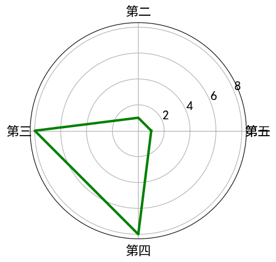

## 直方图

> 用来描述连续型数据的频数分布的状态，**一般用于正态分布的数据，如升高、成绩这些**

- 调用方法：**plt.hist(x, bins=10, range=None, normed=False, weights=None, cumulative=False, bottom=None, histtype=‘bar’, align=‘mid’, orientation=‘vertical’, rwidth=None, log=False, color=None, label=None, stacked=False)**
- 参数说明：
    - **x：指定要绘制直方图的数据；**
    - **bins：指定直方图条形的个数；**
    - **range：指定直方图数据的上下界，默认包含绘图数据的最大值和最小值；**
    - density：是否将直方图的频数转换成频率；
    - weights：该参数可为每一个数据点设置权重；
    - cumulative：是否需要计算累计频数或频率；
    - bottom：可以为直方图的每个条形添加基准线，默认为0；
    - histtype：指定直方图的类型，默认为bar，除此还有’barstacked’, ‘step’, ‘stepfilled’；
    - align：设置条形边界值的对其方式，默认为mid，除此还有’left’和’right’；
    - orientation：设置直方图的摆放方向，默认为垂直方向；
    - rwidth：设置直方图条形宽度的百分比；
    - log：是否需要对绘图数据进行log变换；
    - color：设置直方图的填充色；
    - label：设置直方图的标签，可通过legend展示其图例；
    - stacked：当有多个数据时，是否需要将直方图呈堆叠摆放，默认水平摆放
    - edgecolor：边界颜色

```python
import numpy as np
import matplotlib.pyplot as plt
# 设置中文显示
plt.rcParams["font.sans-serif"] = "SimHei"
# 设置正常显示符号
plt.rcParams["axes.unicode_minus"] = False

#用来描述连续型数据的频数分布的状态，一般用于正态分布的数据，如升高成绩这些

#升高数据
data=np.random.normal(165,20,1000)  #生成正态分布数据的函数

plt.hist(data,bins=15,rwidth=0.9,color='g',edgecolor='y')
# plt.hist(data,bins=15,rwidth=0.9,color='g',edgecolor='y',range=(150,180))
plt.xlabel("升高(cm)")
plt.ylabel("人数")
plt.title("1000个学生身高分布直方图")

plt.show()
```


## 箱型图

> 也是用来**表述数据的分布的**
- 调用方法：**plt.boxplot(x, notch=None, sym=None, vert=None, whis=None, positions=None, widths=None, patch_artist=None, meanline=None, showmeans=None, showcaps=None, showbox=None, showfliers=None, boxprops=None, labels=None, flierprops=None, medianprops=None, meanprops=None, capprops=None, whiskerprops=None)**
- 参数说明：
    - x：指定要绘制箱线图的数据；
    - notch：是否是凹口的形式展现箱线图，默认非凹口；
    - sym：指定异常点的形状，默认为+号显示；
    - vert：是否需要将箱线图垂直摆放，默认垂直摆放；
    - whis：指定上下须与上下四分位的距离，默认为1.5倍的四分位差；
    - positions：指定箱线图的位置，默认为[0,1,2…]；
    - widths：指定箱线图的宽度，默认为0.5；
    - patch_artist：是否填充箱体的颜色；
    - meanline：是否用线的形式表示均值，默认用点来表示；
    - showmeans：是否显示均值，默认不显示；
    - showcaps：是否显示箱线图顶端和末端的两条线，默认显示；
    - showbox：是否显示箱线图的箱体，默认显示；
    - showfliers：是否显示异常值，默认显示；
    - boxprops：设置箱体的属性，如边框色，填充色等；
        - boxprops = {‘color’:‘g’, ‘facecolor’:‘yellow’}
        - ‘color’ : ‘g’ 箱子外框的颜色
        - ‘facecolor’ : ‘yellow’ 箱子填充的颜色
    - labels：为箱线图添加标签，类似于图例的作用；
    - flierprops：设置异常值的属性，如异常点的形状、大小、填充色等；
    - medianprops：设置中位数的属性，如线的类型、粗细等；
    - meanprops：设置均值的属性，如点的大小、颜色等；
    - capprops：设置箱线图顶端和末端线条的属性，如颜色、粗细等；
    - whiskerprops：设置须的属性，如颜色、粗细、线的类型等

- 直方图的概念（四分位距）

  

  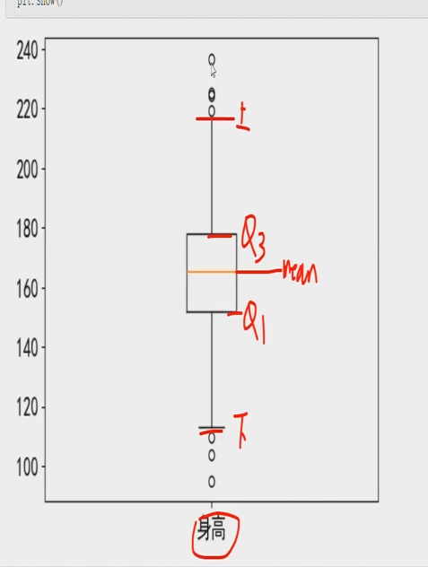

- **四分位距=IQR=Q3-Q1,上限=Q3+1.5*IQR，下限=Q1-1.5*IQR ,MAX， MIN**

  ```python
  # 代码 3-14
  import numpy as np
  import matplotlib.pyplot as plt
  # 设置中文显示
  plt.rcParams["font.sans-serif"] = "SimHei"
  # 设置正常显示符号
  plt.rcParams["axes.unicode_minus"] = False
  # 从文件导入数据
  data=np.load("data/国民经济核算季度数据.npz",allow_pickle=True)
  name=data['columns']
  values=data['values']
  name
  values[0]
  # 设置画布
  plt.figure(figsize=(6,4))
  # 绘制箱型图 三大产业
  gpd=values[:,3:6]
  plt.boxplot(gpd,labels=name[3:6],showmeans=True,patch_artist=True)
  # 添加图表标题
  plt.title("三大产业国民生产总值箱型图")
  # 保存图形到文件
  
  # 显示图形
  plt.show()
  ```

  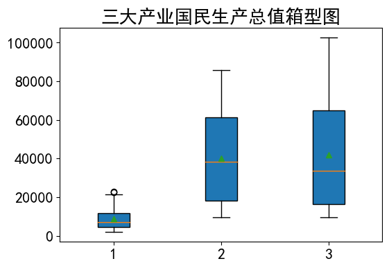

- 小提琴图

```python
# 补充：小提琴图violin
import numpy as np
import matplotlib.pyplot as plt
# 设置中文显示
plt.rcParams["font.sans-serif"] = "SimHei"
# 设置正常显示符号
plt.rcParams["axes.unicode_minus"] = False
# 生成数据
data=np.random.normal(165,20,1000)  #生成正态分布数据的函数
data2=np.random.normal(160,15,1000)

plt.figure(figsize=(6,4))
plt.violinplot([data,data2],showmeans=True,widths=[0.4,0.4])
```


- 1

- 极坐标系

  ```python
  
  ```

- 1

- 极坐标系

  ```python
  
  ```

- 1

## 常用函数

| [flt.]函数名           | 说明                                        | 调用                                                  |
| ---------------------- | ------------------------------------------- | ----------------------------------------------------- |
| figure                 | 设置画布，创建一个实例                      | fig=plt.figure(figsize=(8,6),dpi=80,facecolor="cyan") |
| fig.add_subplot(n,m,x) | 设置子图，前两个是几行几列，x是第几辐画     | ax1=fig.add_subplot(2,1,1)                            |
| title()                | 设置某子图标题                              | plt.title("子图示例1")                                |
| xlabel()               | x轴名称                                     | plt.xlabel("x")                                       |
| ylabel()               |                                             |                                                       |
| xlim()                 | x轴范围                                     | plt.xlim([0,1])                                       |
| ylim()                 |                                             |                                                       |
| xticks()               | x轴刻度                                     | plt.xticks([0,0.5,2])  #可以不均匀，权限大于范围lim   |
| plot(x,y,label="name") | 画图，label里用latex表示                    | plt.plot(rad,rad**2,label="$y=x^2$")                  |
| legend()               | 显示图例，loc="center left"表示位于中间左侧 |                                                       |
| grid()                 | 显示网格                                    |                                                       |
| subplots_adjust()      | 调整各子图的高度间隔                        | plt.subplots_adjust(hspace=0.3,wspace=0)              |
| savefig()              | 保存图形到文件                              | plt.savefig("./data/")                                |
| show()                 | 显示图像，没有也会默认显示                  |                                                       |

# pandas

> **分布的补充**
>
> **均匀：都是均匀的**
>
> **正态分布：中间高两边低**

- **数据类型**

  1. **Series：一维**，带标签数组
  
     Series有索引和数据值组成，有index和values属性
  
  2. **DataFrame：二维**，Series容器，由列和Series组成
  
  > numpy是ndarray和ufunc

## series的使用

> 用法和数组类似，**区别是可以改index，要求数据是同一个类型**

```python
# series索引和切片
 # 不包含结束的索引位置
 # 包含结束索引名
list=[21.2,4.1,54,6.7]
ser1=pd.Series(list,index=['a','e','c','d'])  #只能一种数据类型
ser1
ser1[2]
ser1[1:3]  #数值是开区间
ser1['e':'c']  #可以用新index进行切片，用非数字型的index是闭区间，因为新index不能-1，即使不是顺序的英文字母也行
```

## DataFrame的使用


### 创建

**pd.DataFrame(data=None, index=None, columns=None**, dtype=None, copy=False)

#### 正常的方式创建

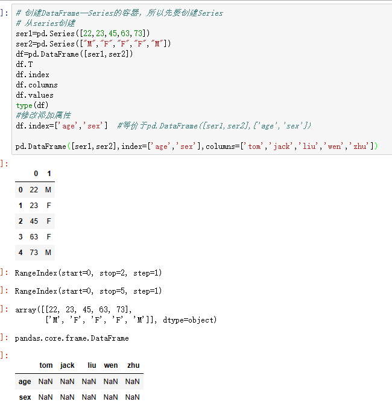

#### 字典的方式创建

> **用字典的方式创建其中键就是columns，索引就是默认的数值范围索引**

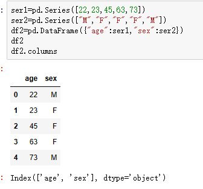


#### 增加列


#### 设置行索引set_index方法


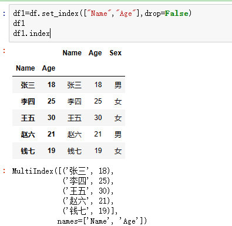

#### 以np数组创建

```python
# np数组生成Dataframe，此时loc和iloc一致
arr=np.arange(20).reshape(4,5)
df=pd.DataFrame(arr)
df
```

|      |    0 |    1 |    2 |    3 |    4 |
| ---: | ---: | ---: | ---: | ---: | ---: |
|    0 |    0 |    1 |    2 |    3 |    4 |
|    1 |    5 |    6 |    7 |    8 |    9 |
|    2 |   10 |   11 |   12 |   13 |   14 |
|    3 |   15 |   16 |   17 |   18 |   19 |


### 取值操作（重点）

#### 取某列的Series

> **类似字典的方式，一个列就是Series，当多个列时就为DataFrame**

```python
#取列 ，取列用的是指定的方式
df3
# 列的调用方式（中括号和点）
# 每一列是一个Series
df3['Name']
df3.Age
#取多个列,不能[0]，默认是对行进行切片，因为axis=0，即横轴
df3[0:3]
df3[['Gender','Age']]  #分别取两个值
```

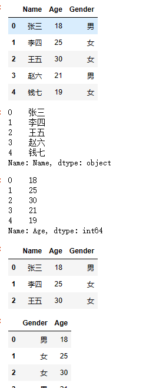

- **按行迭代的方式**

  ```python
  #按行迭代
  df.head()
  for index,row in df.iterrows():
      print(index,end="：")
      print(row['tip'])
      pd.DataFrame()
  ```

  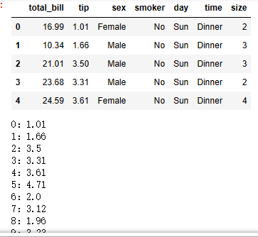

#### 取某行的DataFrame

> **类似np数组切片的方式**

```python
#取行,取行用的是切片的方式
dic = {"Name":["张三","李四","王五","赵六","钱七"],
      "Age":[18,25,30,21,19],
      "Gender":["男","女","女","男","女"]}
df3=pd.DataFrame(dic)
df3[0:3]
df3.index=['a','b','c','d','e']
df3
df3['a':'d']
# df3[['a','b','c']] #取列的操作
df3[0:2]
```


#### 取某列某行（复合使用）

```python
###先筛选列后筛选行
# 闭区间
df["Name"]["li":"zhao"]
 # 开区间
df["Name"][1:4]
df["Name"][4]   #series才可以

df[["Name","Age"]]
df[["Name","Age"]]["li":"zhao"]  #闭区间
df[["Name","Age"]][1:4]  #半开半闭
# df[["Name","Age"]][1]  #dataframe就不能这样了，必须要切片


###先筛选行后筛选列
df["li":"zhao","Name","Age"]
```


#### query方法

```python
detail.query("order_id==413")[['dishes_name','counts']]
#结果选自index列和['dishes_name','counts']列的order_id=413的数据
```

### 增删改

```python
# 增加一列“Province”，设为“广东”
df["Province"]="广东"

# 增加一列“City”
df["City"]=["深圳","广州","广州","珠海","肇庆"]

# 删除“钱七”这一行
df.drop(4,axis=0,inplace=False)

# 删除City列，第一个参数是索引名，axis=0是删行，1是删列，inplace表示是否原地修改
df.drop("City",axis=1,inplace=False)#df.drop(4,axis=0,inplace=True)

#pop返回删除后的Series，直接原地修改，没有会报错
df.pop("Province")
```


### loc的使用（重点）

#### 基本使用

> 有loc和iloc，iloc就是用数字索引来操作，loc就是字符索引
>
> - loc属性是针对DataFrame索引名称的切片方法，**如果传入的不是索引名称，那么切片操作将无法执行**。利用loc属性，能够实现所有单层索引切片操作。loc属性的使用方法如下。
>   **DataFrame.loc[行索引名称或条件, 列索引名称]**
> - iloc和loc区别是iloc接收的必须是行索引和列索引的**位置**。iloc属性的使用方法如下。
>   **DataFrame.iloc[行索引位置, 列索引位置]**

```python
# 索引名称，返回series
df.loc['zhang']
type(df.loc['zhang'])
#索引位置，类似series的方式用，取值，返回series
df.iloc[2]
type(df.iloc[2])		
```


#### loc的花式索引

```python
# loc方法索引和切片, 推荐的方式，也可以实现多行多列
df
#先行后列，类似ndarray里
df.loc["zhao","Age"]
df.iloc[3,1]

df.loc[['zhao','qian'],'Age']
df.loc[['zhao','zhang'],['Age','Sex']]

```


#### loc的条件索引

```python
# 条件切片, 要用条件只能用loc，不用iloc
# 年龄小于20的姓名
df
df.loc[df["Age"]<20,:]  #只有行有条件，列没有
df.loc[df["Age"]<20,["Name","Age"]]
df.loc[df["Age"]<20,:][["Name","Age"]]  #等价于上式

# df.iloc[df[1]<20,:]  #因为iloc不支持，所以会报错
#如果一定要用iloc的方式
df.iloc[(df["Age"]<20).values,]

# # 条件切片，age<20的所有人
df["Age"]<20  #返回一个布尔型的series
```

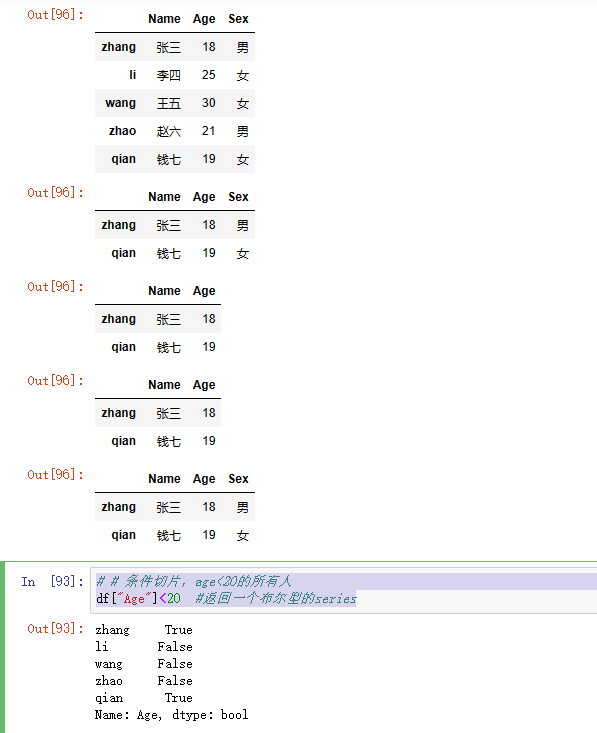

#### loc使用多个条件

**条件部分用(条件1)&(条件2)...表示**

```python

#给小费多于6快的数据：再按照性别统计小费均值，多个条件可以用()&()连接
tips.loc[tips['tip']>6,['tip','sex']].loc[tips['sex']=='Male','tip'].mean()
tips.loc[tips['tip']>6,['tip','sex']].loc[tips['sex']=='Female','tip'].mean()
tips.loc[(tips['day']=="Sat")&(tips['time']=="Dinner"),'tip'].mean()
```


### DataFrame的数据查看


### DataFrame的方法

- .rank()：按数值求出名词
- .sort_index(**axis=0,ascending=True**)
- .sort_values(**column,ascending=True**)


### DataFrame的统计计算


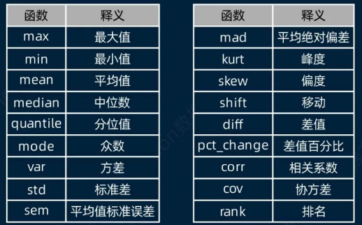

```python
df
# 按性别统计人数，以下例子都是先取出一个Series
df["Sex"].value_counts()
# 非重复值的数量
df.nunique()
df["Sex"].unique()
---------------------------
# 平均年龄
df['Age'].mean()
np.mean(df["Age"])
df["Age"].min()
```

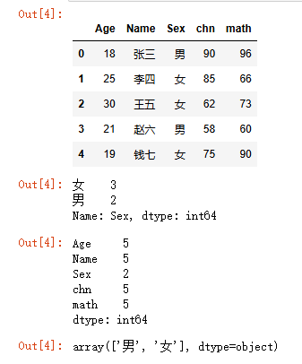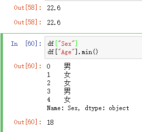

```python
#取出DataFrame再用，用两层括号
df[["Sex"]]
# 语文和数学平均分
df[["chn","math"]].mean()  #等价于df['chn'].mean();df['math'].mean()
# 最高最低分
df[["chn","math"]].max()
df[["chn","math"]].min()

# 添加一列平均分Aver
df["Aver"] = (df["chn"] + df["math"]) / 2
df
```


## 分组聚合

### 基本使用

**要求df包含column列：df.groupby(by=['column','column2'...])[取需要的列].聚合函数|agg(np.聚合属性|"聚合名")|apply(np.聚合属性|"聚合名")**

**不要求df包含column列：df.groupby(by=df['column'])**


```python
import pandas as pd
dict = {"Name":["张三","李四","王五","赵六","钱七"],
       "Age":[18,25,30,21,19],
       "Sex":["男","女","女","男","女"],
       "chn":[90,85,62,58,75],
       "math":[96,66,73,60,90]}
df = pd.DataFrame(dict)
df
# 按性别求均值，dataframe，前dataframe，后列或series
df[['Age','Sex']].groupby(by='Sex')
df[['Age','Sex']].groupby(by='Sex').mean()
#另一种方式，series，前series后series
type(df['Age'].groupby(by=df['Sex']))
df['Age'].groupby(by=df['Sex']).mean()
```


### 输出组内成员

- **df.get_group('column')**

```python
#分组对象，进行调用和遍历
group1=df.groupby(by='Sex')
group1
group1.get_group('男')  #通过上面定义的对象，访问其内部分类好的组
group1.get_group("女")
#不知道分组里面有啥，通过循环遍历该次分组的所有项（值）
for key,gr in group1:
    print(key)
    print(gr)
    print("**********************************")
```

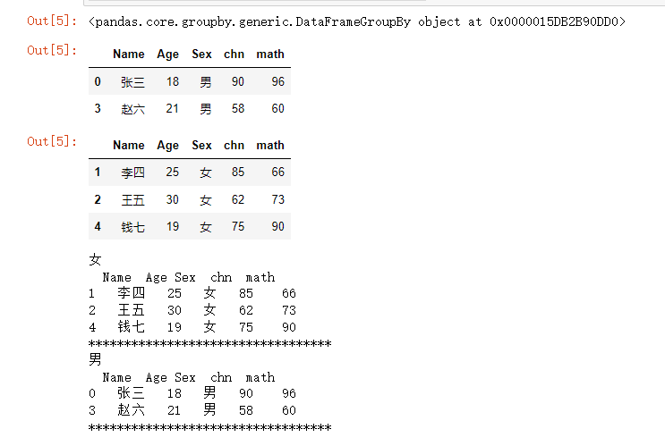

### apply和agg的使用

```python
# apply不支持分组的多个函数聚合
#df.groupby(by="Sex")[["chn","math"]].apply([np.sum,np.mean])

df.groupby(by="Sex")[["chn","math"]].apply("mean")
#分组之后的apply（np）方法却不一样，结果是chn和math加起来的均值
df.groupby(by="Sex")[["chn","math"]].apply(np.mean)

#除了apply的另一种方法：agg，既分组又多个函数聚合
df.groupby(by="Sex")[["chn","math"]].agg("mean")
df.groupby(by="Sex")[["chn","math"]].agg(np.mean)  #这里的agg（np）就相同了，不像apply
```

### 运用lamda函数

```python
# 将语文和数学分数变为10分制。lambda函数，语法：lambda 形参:返回值
df
df[['chn','math']].apply(lambda x:np.round(x/10,1))
df[['chn','math']].agg(lambda x:np.round(x/10,1))
```


### apply和agg的高级用法

```python
# 分组聚合的应用，复杂的用agg就行了，简单随便用

# apply不支持分组的多个函数聚合，分组单个函数就可以
df.groupby(by="Sex")[["chn","math"]].apply("sum")
#df.groupby(by="Sex")[["chn","math"]].apply([np.sum,np.mean])

#但是agg支持，aggregate，所以可以主要使用agg，要用lambda才用apply
df.groupby(by="Sex")[['chn','math']].agg([np.sum,np.mean])
df.groupby(by="Sex")[['chn','math']].agg({'chn':np.sum,'math':np.mean})#apply不行

#agg还支持多个函数
result=df.groupby(by="Sex")[['chn','math']].agg({'chn':[np.sum,np.min],'math':[np.mean,np.max]})
result
result.columns  #两层了，叫Multiindex
```

## 聚合排序

### 非分组

```python
# 非分组的聚合排序（np的sort函数作为参数），注意，分组后，用sort的话只能用apply
df[['total_bill','tip']].apply(np.sort).head()
df[['total_bill','tip']].agg(np.sort).head()
```


### 分组

```python
#按照性别分组，取每个组小费最多的前五名
df.groupby(by='sex')['tip'].apply(np.sort)  #这里没法使用agg方法
#女，取第0组
df.groupby(by='sex')['tip'].apply(np.sort)[0][-5:]
#男
df.groupby(by='sex')['tip'].apply(np.sort)[1][-5:]

#别的方式1
df.sort_values(by=['tip','sex']).groupby(by='sex')[['sex','tip']].tail()
#别的方式2，这里的lambda对于agg不能使用，若有apply或agg用不了的函数或想使用参数的话可以用lambda，复杂的lambda就只能用apply
df.groupby(by='sex').apply(lambda x:x.sort_values(by='tip',ascending=False).head())[['sex','tip']]
```


## DataFrame的交叉表

**pd.crosstab(index,columns,values=None**,rownames=None,colnames=None,**aggfunc=None..) -> 'DataFrame'**

```python
# 以性别和班级形成交叉表
# crosstab函数的columns、index、values、aggfunc等参数
df.groupby(by=["Class","Sex"]).size()
# pd.crosstab(index,columns,values=None,rownames=None,colnames=None,aggfunc=None,margins: 'bool' = False,
#     margins_name: 'Hashable' = 'All',dropna: 'bool' = True,normalize: 'bool' = False,
# ) -> 'DataFrame'
pd.crosstab(df['Sex'],df['Class'])
pd.crosstab(columns=df['Sex'],index=df['Class'])
pd.crosstab(index=df['Sex'],columns=df['Class'],margins=True)  #自动带个all

# 复杂的交叉表（可以用透视表）
#pd.crosstab(index=df['Class'],columns=df['Sex'],values=df['chn'],aggfunc="mean")#对values进行聚合
pd.crosstab(index=[df['Class'],df['Name']],columns=df['Sex'],values=df['chn'],aggfunc="mean")
```


## DataFrame的透视表

**pd.pivot_table(data: 'DataFrame',values=None,index=None,columns=None,**


## 时序数据的操作

### 时序类型转换

**pd.to_datetime()**

### 时许数据的读取

**时序数据.dt.year|month|day**

```python
###################读数据
# 选取时间段
apple.loc[apple['Date']=="2014-07-08",:]
#选择2012年的数据，str.contains方法：选取包含某字符串的信息，只能针对字符串使用
apple.loc[apple['Date'].str.contains("2012"),:]

# 将Date列转换为日期时间类型
apple["Date"]=pd.to_datetime(apple["Date"])  #不赋值原本不动
#还可以用原来的方式，但不能用字符串方法
apple.loc[apple['Date']=="2014-07-08",:]


######################取年月日
# 选择年、月和日的字段
apple['Date'].dt
apple['Date'].dt.year
apple['Date'].dt.month
apple['Date'].dt.day
#设置年、月和日的字段
apple['Year']=apple['Date'].dt.year
apple['Month']=apple['Date'].dt.month
apple['Day']=apple['Date'].dt.day
```

### 其他操作（重采样和生产时间数据）

```python
# 时序数据分组的操作，可以存在列没有by这一列，然后调用时间序列的方法进行分组
apple.groupby(by=apple.index.year)[['Open','Close']].agg("mean")

# 重采样resample（重要），相当于对时序数据的分组
apple.resample("10Y")['Open'].mean()  #10Y：每十年取一次
apple.resample("10M")['Open'].mean()
apple.resample("20W")['Open'].mean()
apple.resample("BM")["Close"].mean()   #月的最后一天

#生成时间类型的数据
pd.date_range(start="20230101",end="20240531",freq="5M")
```


### 实例

```python
#扩展例子
df=pd.read_excel("data/PM25.xlsx")
df.head()
df1=df.set_index("月份")
df1.head()
#重采样，这里表示一年一取
df1.resample("Y")["PM2.5","PM10","CO"].mean().plot.line()
```

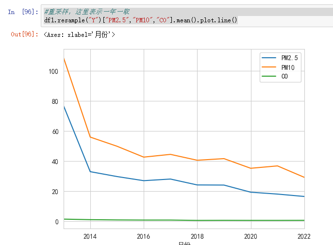

## pandas的画图

> **可以随意和pyplot搭配，pandas里仅仅是随意快速的画出图，具体的设置要用plt来实现**
>
> 1. **折线：df.plot(ax=)==df.plot.line(ax=)**
> 2. **散点：plot(kind="scatter",x=,y=,ax=)**
> 3. **条形图：plot.bar(ax=)**
> 4. 直方图：plot.hist(edgecolor,rwidth,**ax=**)
> 5. 箱型图：plot.box(**ax=**)或boxplot(**ax=**)
> 6. 饼图：plot.pie(figsize=(),autopct='%.1f%%',explode=[],labels=,**ax=**)

```python
# 绘制语文和数学关系的散点图
df.plot(kind="scatter",x="chn",y="math",title="语文数学成绩关系散点图")
# 语文数学折线图
df.plot.line(y=["chn","math"])
# 语文成绩条形图
df.plot.bar(x="Name",y=["chn","math"])
# 横向条形图
df.plot.barh(x="Name",y="chn")

# Series绘图
df["chn"].plot.bar()
df['math'].plot.line()

# 语文数学成绩条形图（堆叠）
df.plot.bar(x="Name",y=["chn","math"],stacked=True)

# 选取字段绘图
df[["chn","math"]].plot.bar()

# 数学成绩直方图
df["math"].plot.hist(edgecolor="red",rwidth=0.95)

# 语文数学成绩的箱型图
df[["chn",'math']].plot.box()

# Pandas快速画图绘图的子图，运用每个画图方法里的ax
fig,ax=plt.subplots(2,2,figsize=(6,6))
df.plot.bar(x="Name",y=["chn","math"],title="语文数学成绩条形图",ax=ax[0,0])
df.groupby(by="Sex").size().plot.pie(ax=ax[0,1])
df[["chn","math"]].plot.box(ax=ax[1,0])
df.plot.scatter(x="chn",y="math",ax=ax[1,1])
```


## pandas的文件读取

### read_table（适用于所有）

**pd.read_table("file",sep=",",encoding='')**

**head（）和tail（）函数：默认读前后5行**

```python
# 从文本文件创建
import pandas as pd
# 两种方法读取csv文件
#read_table，会把第一行作为columns
df1=pd.read_table("./data/scores.txt")  #read_xx有很多的方法读文件的，自选，还有json
df1.head(3)  #默认返回前5行
type(df1)

#csv也可以用read_table，需要指定sep分隔符
df2=pd.read_table("data/scores.csv",sep=",",encoding='gbk')
df2.head(1)

#read_csv
df3=pd.read_csv("data/scores.csv",encoding='gbk')
df3.head(1)

# read_excel
df4=pd.read_excel("data/users.xlsx",sheet_name="users2")
df4.head(1)
df2["num"] 
```


### read_(excel,csv,...)

**pd.read_csv("data/scores.csv",encoding='gbk',index_col="num")#设置某一个column作为index**

### 保存数据集

```python
# 带索引或不带索引，index表示是否保存，false的话DataFrame的index就会去掉，直接保存values和columns
tips.to_csv("data/tips_to_csv.csv",index=True)
tips.to_csv("data/tips_to_csv1.csv",index=False)
```

# pandas数据预处理

## 合并数据

### concat函数

**pd.concat([df1,df2],axis=,ignore_index=,join="inner|outer")**


### merge函数

**pd.merge(left**: 'DataFrame | Series',**right**: 'DataFrame | Series',
    **how**: 'MergeHow' = 'inner',**on**: 'IndexLabel | None' = None,
    **left_on**: 'IndexLabel | None' = None**,right_on**: 'IndexLabel | None' = None,
    left_index: 'bool' = False,right_index: 'bool' = False,
    sort: 'bool' = False,suffixes: '**Suffixes**' = ('_x', '_y'),  #指明重复名字自动添加，用于区分的，因为不能重名
) -> 'DataFrame'


```python
pd.merge(df_score,df_class_1,on="班级编号",how="inner")
pd.merge(df_score,df_class_1,on="班级编号",how="outer")
pd.merge(df_score,df_class_1,on="班级编号",how="left")
pd.merge(df_score,df_class_1,on="班级编号",how="right")
```

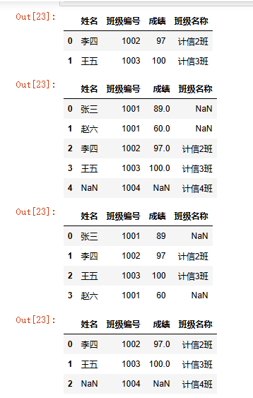

### join方法

> **使用join函数，则需要两个表主键名字相同**

df_score.join(df_class_1,on="班级编号")

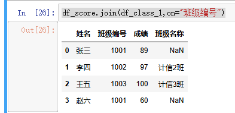

## 数据清洗

### 去重

**df.drop_duplicates(inplace=True,keep="last")**

### 缺失值的处理

```python
# 发现缺失值
iris.isnull().sum()
# 非缺失值有
iris.notnull().sum()
# petal_width_cm列缺失值所在行
iris.loc[iris["petal_width_cm"].isnull(),:]

## 缺失值处理
# 1、删除缺失值axis=0
df=iris.dropna(axis=0,how="any",inplace=False)
df.shape
# axis=1，不适合
df1=iris.dropna(axis=1,how="any",inplace=False)
df1.shape
# 2、填充缺失值（前向、后向）
#前向
df3=iris.fillna(method="ffill")
df3.head(15)
#后向
df4=iris.fillna(method="bfill")
df4.head(15)
# 3、填充具体值，只适用于这种已知道只有某一列有空的情况
df5=iris.fillna(0.2)
df5.head(15)
# 列填充具体值，相比于上述，更适应所有情况
iris["petal_width_cm"]=iris["petal_width_cm"].fillna(0.35)
iris.head(15)
# 类别均值, 在这里比较合适。
m=iris.loc[iris["class"]=="Iris-setosa","petal_width_cm"].mean()
m
# 类别均值填充
iris["petal_width_cm"].fillna(m,inplace=True)
iris.head(15)
```

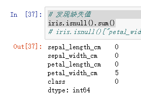


### 异常值处理

用describe()或describe(include='all')来查看有无特别偏离的异常


```python
# 绘图方式发现异常值，散点图
iris.plot.scatter(x="sepal_length_cm",y="sepal_width_cm")
# 直方图发现异常
iris["sepal_length_cm"].plot.hist()
# 箱型图发现异常
iris["sepal_length_cm"].plot.box()
# 定位异常位置
iris.loc[iris['sepal_length_cm']<1,:]
# 具体行
iris.loc[iris['sepal_length_cm']<1,"sepal_length_cm"]*=100
iris.describe()
```


## 数据转换

### 函数转换

```python
# 一般会把文本数据简单数值化，例如性别变为0和1
# 定义转换函数
def transform(gender):
    if gender=="女":
        return 0  #男1女0
    elif gender=="男":
        return 1
scores["gender"]=scores["gender"].agg(transform)
scores.head()
#还可以
#scores["gender"].apply(lambda x:0 if x=="女" else 1)
#scores["gender"].map({"女":0,"男":1})
```

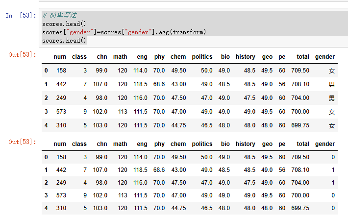

### 哑变量

```python
# 性别的哑变量处理
genders=pd.get_dummies(scores["gender"],prefix="gender")
genders
# 哑变量合并到数据
scores=pd.concat([scores,genders],axis=1)
scores.head()
```

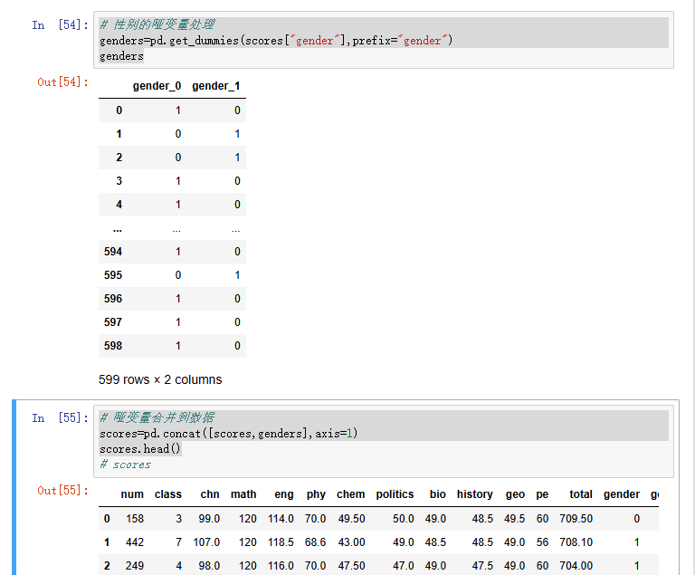

### 离散化

```python
# 对英语成绩离散化
scores["chn"]=pd.cut(scores["chn"],bins=[0,72,84,96,108,120],labels=["不及格","及格","中等","良好","优秀"])
```


