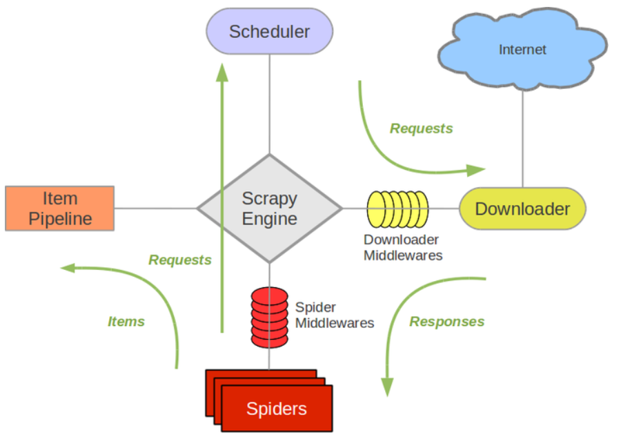
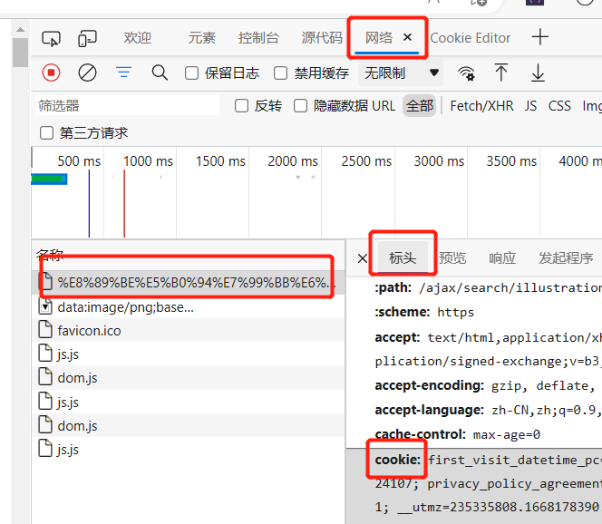

# 1. 概述

## 1.1. 框架

<div align="center">
    
</div>

- **Scrapy Engine(引擎):** 负责Spider、ItemPipeline、Downloader、Scheduler中间的通讯，信号、数据传递等
- **Scheduler(调度器):** 它负责接受引擎发送过来的Request请求，并按照一定的方式进行整理排列，入队，当引擎需要时，交还给引擎
- **Downloader（下载器）：** 负责下载Scrapy Engine(引擎)发送的所有Requests请求，并将其获取到的Responses交还给Scrapy Engine(引擎)，由引擎交给Spider来处理
- **Spider（爬虫）：** 它负责处理所有Responses,从中分析提取数据，获取Item字段需要的数据，并将需要跟进的URL提交给引擎，再次进入Scheduler(调度器)
- **Item Pipeline(管道)：** 它负责处理Spider中获取到的Item，并进行进行后期处理（详细分析、过滤、存储等）的地方
- **Downloader Middlewares（下载中间件）：** 你可以当作是一个可以自定义扩展下载功能的组件
- **Spider Middlewares（Spider中间件）：** 你可以理解为是一个可以自定扩展和操作引擎和Spider中间通信的功能组件（比如进入Spider的Responses;和从Spider出去的Requests）

## 1.2. 运作流程

```bash
1 引擎：Hi！Spider, 你要处理哪一个网站？
2 Spider：老大要我处理xxxx.com。
3 引擎：你把第一个需要处理的URL给我吧。
4 Spider：给你，第一个URL是xxxxxxx.com。
5 引擎：Hi！调度器，我这有request请求你帮我排序入队一下。
6 调度器：好的，正在处理你等一下。
7 引擎：Hi！调度器，把你处理好的request请求给我。
8 调度器：给你，这是我处理好的request
9 引擎：Hi！下载器，你按照老大的下载中间件的设置帮我下载一下这个request请求
10 下载器：好的！给你，这是下载好的东西。（如果失败：sorry，这个request下载失败了。然后引擎告诉调度器，这个request下载失败了，你记录一下，我们待会儿再下载）
11 引擎：Hi！Spider，这是下载好的东西，并且已经按照老大的下载中间件处理过了，你自己处理一下
12 Spider：（处理完毕数据之后对于需要跟进的URL），Hi！引擎，我这里有两个结果，这个是我需要跟进的URL，还有这个是我获取到的Item数据。
13 引擎：Hi ！管道 我这儿有个item你帮我处理一下！调度器！这是需要跟进URL你帮我处理下。然后从第四步开始循环，直到获取完老大需要全部信息。
14 管道调度器：好的，现在就做！
```

# 2. 安装和启动
## 2.1. 安装和创建项目

1. 安装 Scrapy

```bash
pip install Scrapy
# 如果报的错和 extensions 相关
pip install typing-extensions==4.3.0
# 最好更新一下这个
pip install attrs --upgrade
```

2. 创建一个 Scrapy 项目，项目目录如下

```bash
# 输入命令
scrapy startproject mySpider
```

```bash
mySpider/
    scrapy.cfg  # 项目的配置文件
    mySpider/
        __init__.py
        items.py        # 项目的目标数据类型文件
        pipelines.py    # 项目的管道文件
        settings.py     # 项目的爬虫相关配置文件
        spiders/        # 存储爬虫代码目录
            __init__.py
            ...
```

## 2.2. 启动爬虫项目

1. 在 mySpider/spider 目录下创建一个爬虫，并指定爬取域的范围，下面以豆瓣为例
    - 会出现一个 爬虫.py 文件

```bash
scrapy genspider 爬虫 "爬虫网址.cn"
```

2. 在 items.py 中创建数据类型

```python
class DoubanItem(scrapy.Item):
    # define the fields for your item here like:
    title = scrapy.Field()
    author = scrapy.Field()
    pass
```

3. 在 spider/douban.py 中编写爬虫

```python
class DoubanSpider(scrapy.Spider):
    name = 'douban'
    allowed_domains = ['movie.douban.com']
    start_urls = ['https://movie.douban.com/top250']

    def parse(self, response):
        # 只需要修改 parse 程序，其他代码已经生成
        sel = scrapy.Selector(response).xpath(r'//*[@id="content"]/div/div[1]/ol')
        for i in range(1, 11):
            douban = DoubanItem()
            # 1. 将爬取结果存储到数据类型对象中
            douban['title'] = sel.xpath(
                r'./li[{}]/div/div[2]/div[1]/a/span[1]/text()'.format(i)).extract_first()
            douban['author'] = sel.xpath(
                r'./li[{}]/div/div[2]/div[2]/p[1]/text()[1]'.format(i))\
                .re(r'导演:\s(?P<author>.*?)\s[A-Z]')
            # 2. 通过 yield 返回一个一个数据方便数据引擎存储
            yield douban
```

## 2.3. settings.py 配置

1. <kbd>BOT_NAME</kbd>：项目名称

2. <kbd>SPIDER_MODULES</kbd> 和 <kbd>NEWSPIDER_MODULE</kbd>
    - 存放爬虫代码文件（py文件）的路径

3. <kbd>ROBOTSTXT_OBEY</kbd>
    - 设置是否需要遵循 robot 协议，默认为 True
    - 通俗来说， robots.txt 是遵循 Robot协议 的一个文件，它保存在网站的服务器中，它的作用是，告诉搜索引擎爬虫，本网站哪些目录下的网页 不希望 你进行爬取收录

4. <kbd>CONCURRENT_ITEMS</kbd>
    - Scrapy downloader 并发请求(concurrent requests)的最大值
    - 默认 16

5. <kbd>DEFAULT_REQUEST_HEADERS</kbd>
    - Scrapy HTTP Request 使用的默认 header

6. <kbd>DEPTH_LIMIT</kbd>
    - 爬取网站最大允许的深度(depth)值。如果为0，则没有限制
    - 默认: 0

7. <kbd>DOWNLOAD_DELAY</kbd>
    - 下载器在下载同一个网站下一个页面前需要等待的时间。该选项可以用来限制爬取速度，减轻服务器压力
    - 支持小数，也可设置随机值
    - 默认情况下，Scrapy 在两个请求间不等待一个固定的值，而是使用0.5到1.5之间的一个随机值

8. <kbd>CONCURRENT_REQUESTS_PER_DOMAIN</kbd>
    - 设置网站的最大并发请求数量
    - 默认是8

9. <kbd>CONCURRENT_REQUESTS_PER_IP</kbd>
    - 设置每个ip的最大并发请求数量
    - 默认是 0
    - 如果非0, CONCURRENT_REQUESTS_PER_DOMAIN 不生效
    - 时的请求并发数量针对于ip, 而不是网站置, DOWNLOAD_DELAY 针对 ip 而不是网站

10. <kbd>DOWNLOAD_TIMEOUT</kbd>
    - 默认: 180
    - 下载器超时时间(单位: 秒)

11. <kbd>ITEM_PIPELINES</kbd>
    - 保存项目中启用的pipeline及其顺序的字典
    - 该字典默认为空
    - 习惯设置在0-1000范围内，值越小优先级越高

```python
ITEM_PIPELINES = {
    'mySpider.pipelines.SomethingPipeline': 300,
    'mySpider.pipelines.ItcastJsonPipeline': 800,
}
```

12. <kbd>LOG_ENABLED</kbd>
    - 默认: True
    - 日志

13. <kbd>LOG_ENCODING</kbd>
    - 默认: ‘utf-8’
    - logging 使用的编码

14. <kbd>LOG_LEVEL</kbd>
    - 默认: ‘DEBUG’
    - 可选的级别有: CRITICAL、ERROR、WARNING、INFO、DEBUG 

15. <kbd>LOG_FILE</kbd>
    - logging 输出的文件名
    - 默认为 None，使用标准错误输出(standard error)

16. <kbd>USER_AGENT</kbd>
    - 默认: “Scrapy/VERSION (+http://scrapy.org)”，直接暴露自己是 spider
    - 建议每次爬取前随机选取

```python
ua_list = [
    'Mozilla/4.0 (compatible; MSIE 7.0; Windows NT 5.1; Maxthon 2.0',
    'Mozilla/5.0 (Macintosh; Intel Mac OS X 10_7_0) AppleWebKit/535.11 (KHTML, like Gecko) Chrome/17.0.963.56 '
    'Safari/535.11',
    'User-Agent:Opera/9.80 (Windows NT 6.1; U; en) Presto/2.8.131 Version/11.11',
    'Mozilla/5.0 (Windows NT 6.1; rv:2.0.1) Gecko/20100101 Firefox/4.0.1',
    'Mozilla/4.0 (compatible; MSIE 7.0; Windows NT 6.0)',
    'Mozilla/5.0 (Windows; U; Windows NT 6.1; en-us) AppleWebKit/534.50 (KHTML, like Gecko) Version/5.1 Safari/534.50',
    'Mozilla/5.0 (compatible; MSIE 9.0; Windows NT 6.1; Trident/5.0',
    'Mozilla/4.0 (compatible; MSIE 7.0; Windows NT 5.1',
    'Mozilla/4.0 (compatible; MSIE 6.0; Windows NT 5.1',
    'Mozilla/5.0 (Macintosh; Intel Mac OS X 10.6; rv:2.0.1) Gecko/20100101 Firefox/4.0.1',
]
USER_AGENT = random.choice(ua_list)
```

17. <kbd>PROXIES</kbd>
    - 代理设置


18. <kbd>COOKIES_ENABLED</kbd>
    - 是否携带 cookie
    - 默认 true

19. <kbd>COOKIES_DEBUG</kbd>
    - 默认 false

# 3. 进阶操作

## 3.1. 多页面爬取

- 定义 <kbd>start_urls</kbd> 会直接爬取这个页面
- 定义 <kbd>start_requests</kbd> 可以在该函数体内执行多个请求
- 原理是 Scrapy 会将 return 或者 yeild 的所有请求体（request）执行请求，然后交给 parse 函数处理并进行下一步操作

```python
import scrapy
from scrapy.http import Request
from myScrapy.items import DoubanItem

class DoubanSpider(scrapy.Spider):
    name = 'douban'
    allowed_domains = ['movie.douban.com']
    # start_urls = ['https://movie.douban.com/top250']

    def start_requests(self):
        """
        爬取十页数据
        """
        for p in range(0, 10):
            # 拼接 url 并返回 request
            yield Request(url='https://movie.douban.com/top250?start={}&filter='.format(str(25*p)))

    def parse(self, response: HtmlResponse):
        """
        解析数据，并返回
        """
        sels = scrapy.Selector(response).xpath(r'//*[@id="content"]/div/div[1]/ol/li')
        for sel in sels:
            douban = DoubanItem()
            douban['title'] = sel.xpath(
                r'./div/div[2]/div[1]/a/span[1]/text()').extract_first()
            douban['author'] = sel.xpath(
                r'./div/div[2]/div[2]/p[1]/text()[1]')\
                .re(r'导演:\s(?P<author>.*?)\s[A-Z]')
            yield douban
```

## 3.2. 爬虫传参

- 我们可以增加分类或者其他参数来命令爬虫，爬虫文件中可以获取这些参数

1. 带参的爬虫启动命令

```python
scrapy crawl spiderName -a parameter1=value1 -a parameter2=value2
```

2. 在 spider 程序中可以通过如下方式获取参数

```python
class MySpider(Spider):
    name = 'myspider'
    ...
    def parse(self, response):
        ...
        if self.parameter1 == value1:
            # this is True
        
        # or also
        if getattr(self, parameter2) == value2:
            # this is also True
```

- 通过使用 <kbd>-a</kbd> 可以向爬虫文件中定义的类传递属性，然后在该类中获取该属性即可实现传入自定义参数


# 4. 管道

- <kbd>pipeline.py</kbd> 中有处理数据的 pipeline 类和实现的方法 <kbd>process_item</kbd>，我们就在这处理并存储数据
- 使用管道处理数据的前提是 <kbd>item.py</kbd> 定义了对象类型，并且爬虫返回的是该对象类型
- 管道定义的方法是钩子方法，由框架执行时自主调用
- 使用前记得定义 <kbd>settings.py</kbd> 中的 <kbd>ITEM_PIPELINES</kbd> 方法

## 4.1. 管道实现的方法

1. <kbd>process_item(self, item, spider)</kbd>
    - 当有数据传输时，对每个项管道组件调用此方法
    - item 是数据对象实例，在 <kbd>item.py</kbd> 中定义，数据传输时传的就是这个实例
    - 必须返回处理好的 item

2. <kbd>open_spider(self, spider)</kbd>
    - 当 spider 打开时调用此方法
    - 一般用于文件预加载，工具预加载

3. <kbd>close_spider(self, spider)</kbd>
    - 当spider关闭时调用此方法
    - 一般用于存储文件，数据后处理

4. <kbd>from_crawler(cls, crawler)</kbd>
    - 爬虫对象提供对所有零碎核心组件（如设置和信号）的访问；它是管道访问它们并将其功能连接到零碎的一种方式

## 4.2. 使用管道保存 xlsx 文件的示例

```python
# settings.py
ITEM_PIPELINES = {
   'myScrapy.pipelines.MyscrapyPipeline': 300,
}
```

```python
# pipelines.py
import openpyxl

class MyscrapyPipeline:
    def __init__(self):
        # 1. 创建工作表
        self.wb = openpyxl.Workbook()
        # 2. 获取工作 sheet
        self.ws = self.wb.active
        # 3. 表头，标题
        self.ws.title = "top250"
        self.ws.append(("标题", "导演"))

    def close_spider(self, spider):
        # 5. 保存成文件
        self.wb.save("top250.xlsx")

    def process_item(self, item, spider):
        # 4. 处理、保存数据
        self.ws.append((item["title"], item['author']))
        return item
```

# 5. 下载中间件（DownloadMidleWare）

- 下载器中间件是Scrapy请求/响应处理的钩子框架。这是一个轻，低层次的系统，**全局范围内改变请求和响应**

## 5.1. 激活中间件

1. 在 <kbd>midlewares.py</kbd> 文件中创建下载中间件类型，这个一般在创建项目后就自动创建好了

2. 在 <kbd>settings.py</kbd> 中配置 <kbd>DOWNLOADER_MIDDLEWARES</kbd> 激活中间件，如

```python
# settings.py
DOWNLOADER_MIDDLEWARES = {
    'myproject.middlewares.CustomDownloaderMiddleware': 543,
}
```

## 5.2. 下载中间件的方法

1. <kbd>process_request(request, spider)</kbd>
    - 当每个Request对象经过下载中间件时会被调用，拦截 request 对象，可以进行修改
    - 优**先级越高**的中间件，**越先**调用
    - 返回值
        - 返回 None：scrapy 会继续执行其他中间件相应的方法
        - 返回Response对象：scrapy不会再调用其他中间件的process_request方法，也不会去发起下载，而是直接返回该Response对象；
        - 返回Request对象：scrapy不会再调用其他中间件的process_request()方法，而是将其放置调度器待调度下载；

2. <kbd>process_response(request, response, spider)</kbd>
    - 当每个Response经过下载中间件会被调用
    - 优**先级越高**的中间件，**越后**调用
    - 返回值
        - 返回Response对象：scrapy会继续调用其他中间件的process_response方法；
        - 返回Request对象：停止中间器调用，将其放置到调度器待调度下载（继续执行 request 请求）

3. <kbd>process_exception(request, exception, spider)</kbd>
    - 当 process_response 和 process_request 抛出异常时会被调用
    - 返回值
        - 如果返回 None：scrapy会继续调用其他中间件的 process_exception()；
        - 如果返回Response对象：中间件链的process_response()开始启动，不会继续调用其他中间件的process_exception()；
        - 如果返回Request对象：停止中间器的process_exception()方法调用，将其放置到调度器待调度下载。

4. <kbd>from_crawler</kbd>
    - 如果存在该函数，from_crawler 会被调用使用 crawler 来创建中间器对象，必须返回一个中间器对象，通过这种方式，可以访问到crawler的所有核心部件，如settings、signals等

## 5.3. 下载中间件应用

### 5.3.1. 中间件设置 cookie 的示例

- 准备 cookie，可以在开发者工具中找到，出现在每次请求的请求头中

<div align="center">
    
</div>

1. 你可以直接在 request 中把这串字符串加入 header 中

```python
cookie_str = "cookie str"

def start_requests(self):
    for p in range(0, 10):
        yield Request(url='https://movie.douban.com/top250?start={}&filter='.format(str(25*p)),
                        headers={
                            "cookie": self.cookie_str
                        })
```

2. 也可以通过解析 cookie 后通过中间件放入

```python
# middlewares.py
def get_cookie_dict(cookieStr: str):
    cookies = {}
    for item in cookieStr.split('; '):
        # 小细节，value 或者 key 可能出现 =
        key, value = item.split("=", maxsplit=1)
        cookies[key] = value
    return cookies


class MyscrapyDownloaderMiddleware:
    ... ...
    def process_request(self, request: Request, spider):
        # Called for each request that goes through the downloader
        request.cookies = get_cookie_dict("cookie str")
        return None
```

- 除了设置 cookie，**生成随机的 USER_AGENT**，修改请求信息等都可以在这个中间件执行

### 5.3.2. 在中间件中集成Selenium

- 对于一些很麻烦的异步加载页面，手动寻找它的后台API代价可能太大。这种情况下可以使用Selenium和ChromeDriver或者Selenium和PhantomJS来实现渲染网页

```python
# middlewares.py
from scrapy.http import HtmlResponse
class SeleniumMiddleware(object):
    def __init__(self):
        # driver 路径
        self.driver_path = '/code/chromedriver'
        # 配置
        # self.chrome_option = EdgeOptions()
        self.chrome_option = ChromeOptions()
        # 无头浏览器
        self.chrome_option.headless = True
        # 解决 DevToolsActivePort 文件不存在的报错
        self.chrome_option.add_argument('--no-sandbox')
        # 不显示界面
        self.chrome_option.add_argument('--disable-gpu')
        # 隐藏滚动条, 应对一些特殊页面
        self.chrome_option.add_argument('--hide-scrollbars')
        # 静音
        self.chrome_option.add_argument('--mute-audio')
        # self.driver = Edge(options=chrome_option)

    def process_request(self, request, spider):
        if spider.name == 'SeleniumSpider':
            self.driver = Chrome(executable_path=self.driver_path, options=self.chrome_option)
            self.driver.get('url')
            # 1. 非增强模式
            el = self.driver.find_element(By.XPATH, r'//*[@id="boxs"]/div[2]/div[1]/div')
            el.click()
            # 2. 输入网址
            el = self.driver.find_element(By.XPATH, r'//*[@id="boxs"]/div[1]/div[1]/input')
            el.send_keys(spider.url)
            el.submit()

            # 返回 selenium 解析后的页面
            body = self.driver.page_source
            # 记得关闭，不然卡死别怪我没提醒
            self.driver.close()
            return HtmlResponse(self.driver.current_url,
                                body=body,
                                encoding='utf-8',
                                request=request)
        else:
            return None
```


# 6. 爬虫中间件（SpiderMiddlewares）

## 6.1. 激活中间件

1. 在 <kbd>midlewares.py</kbd> 文件中创建下载中间件类型，这个一般在创建项目后就自动创建好了

2. 在 <kbd>settings.py</kbd> 中配置 <kbd>SPIDER_MIDDLEWARES </kbd> 激活中间件，如

```python
# settings.py
SPIDER_MIDDLEWARES = {
    'myproject.middlewares.CustomSpiderMiddleware': 543,
}
```

## 6.2. 爬虫中间件的方法

1. <kbd>process_spider_input(response, spider)</kbd>
    - 当 Response 被 Spider 处理时，方法被调用；也就是在下载器中间件处理完成后，马上要进入某个回调函数parse_xxx()前调用
    - 这个方法在将 response 发往 spider 的过程中被调用，可以用于处理网页返回的 response 和它所携带的数据
    - 返回值：
        - 如果它返回 None，Scrapy 将会继续处理该 Response，调用所有其他的 Spider Middleware

2. <kbd>process_spider_output(response, result, spider)</kbd>
    - 爬虫运行 yield item 或者 yield scrapy.Request() 的时候调用
    - 在这个方法处理完成以后，数据如果是item，就会被交给pipeline；如果是请求，就会被交给调度器
    - 所以在这个方法里面可以进一步对item或者请求做一些修改
    - 必须返回包含 Request 或 Item 对象的可迭代对象

3. <kbd>process_spider_exception(response, exception, spider)</kbd>
    - 当Spider或Spider Middleware的process_spider_input()方法抛出异常时，方法被调用

# 7. Scrapyd 部署项目

## 7.1. 安装和启动

- Scrapyd 是一个独立项目，不是直接在项目中使用的，安装之后将他作为服务打开，即可将爬虫项目部署在 Scrapyd 中

1. 安装

```bash
pip install scrapyd
pip install scrapyd-client
```

2. 启动服务

```bash
scrapyd
```

## 7.2. 部署项目

1. 项目根目录 <kbd>scrapy.cfg</kbd> 进行如下修改

```python
# 解除注释
# localhost 可以改成你要部署到的服务器的地址，但是建议 scrapyd 服务和 scrapy 项目本身都在一台 IP 中
# 6800 是访问的端口，可以改成其他的
url = http://localhost:6800/
```

2. 在项目根目录下（启动 scrapyd 后）

```python
scrapyd-deploy
```

## 7.3. 通过 API 使用爬虫

1. web 页面

```bash
http://localhost:6800/
```

2. 调度爬虫（以下有参数的都是 POST），会返回 JobID

```bash
# url
http://localhost:6800/schedule.json 
# data
{
    project: "myScrapy",
    spider: "mySpider",
    # 如果是带参数的 scrapy 爬虫
    arg1: "value1",
    arg2: "value2",
}
```

3. 取消运行

```bash
# url
http://localhost:6800/cancel.json
# data
{
    project: "myScrapy",
    job: "JobID",
}
```

4. 列出项目

```bash
http://localhost:6800/listprojects.json
```

5. 列出 scrapyd 版本

```bash
# url
http://localhost:6800/listversions.json
# data
{
    project: "myScrapy",
}
```

6. 列出爬虫

```bash
# url
http://localhost:6800/listspiders.json
# data
{
    project: "myScrapy",
}
```

7. 列出job

```bash
# url
http://localhost:6800/listjobs.json
# data
{
    project: "myScrapy",
}
```

8. 删除项目

```bash
# url
http://localhost:6800/delproject.json
# data
{
    project: "myScrapy",
}
```
