# 爬虫概念
> 网络爬虫又称网络蜘蛛、网络机器人，它是一种按照一定的规则自动浏览、检索网页信息的程序或者脚本。网络爬虫能够自动请求网页，并将所需要的数据抓取下来。通过对抓取的数据进行处理，从而提取出有价值的信息。

- 我们所熟悉的一系列搜索引擎都是大型的网络爬虫，每个搜索引擎都拥有自己的爬虫程序

## 爬虫分类
1. **<font color=#EA5>通用网络爬虫</font>**：是搜索引擎的重要组成部分，通用网络爬虫需要遵守 <kbd>robots</kbd> 协议，网站通过此协议告诉搜索引擎哪些页面可以抓取，哪些页面不允许抓取。
2. **<font color=#EA5>聚焦网络爬虫</font>**：是面向特定需求的一种网络爬虫程序。它与通用爬虫的区别在于，聚焦爬虫在实施网页抓取的时候会对网页内容进行筛选和处理，尽量保证只抓取与需求相关的网页信息。聚焦网络爬虫极大地节省了硬件和网络资源，由于保存的页面数量少所以更新速度很快，这也很好地满足一些特定人群对特定领域信息的需求。
3. **<font color=#EA5>增量式网络爬虫</font>**：是指对已下载网页采取增量式更新，它是一种只爬取**新产生**的或者已经**发生变化**网页的爬虫程序，能够在一定程度上保证所爬取的页面是**最新**的页面。

## 应用
1. **<font color=#EA5>数据分析</font>**：在数据分析领域，网络爬虫通常是搜集海量数据的必备工具。对于数据分析师而言，要进行数据分析，首先要有数据源，而学习爬虫，就可以获取更多的数据源。在采集过程中，数据分析师可以按照自己目的去采集更有价值的数据，而过滤掉那些无效的数据
2. **<font color=#EA5>商业领域</font>**：对于企业而言，及时地获取市场动态、产品信息至关重要。企业可以通过第三方平台购买数

## 为什么用Python做爬虫
1. 不止 Python 这一种语言可以做爬虫，诸如 PHP、Java、C/C++ 都可以用来写爬虫程序，但是相比较而言 Python 做爬虫是最简单的
2. python 语言，其语法优美、代码简洁、开发效率高、支持多个爬虫模块，比如 urllib、requests、Bs4 等。Python 的请求模块和解析模块丰富成熟，并且还提供了强大的 Scrapy 框架，让编写爬虫程序变得更为简单

## 编写爬虫的流程
1. 先由 urllib 模块的 request 方法打开 URL 得到网页 HTML 对象。（学习 [HTML](/前端/HTML/HTML.md)）
2. 使用浏览器打开网页源代码分析网页结构以及元素节点。
3. 通过 Beautiful Soup 或则正则表达式提取数据。
4. 存储数据到本地磁盘或数据库。

## 善用浏览器检查网页构成元素

<div align="center">
    
</div>

## 渲染类型
1. **<font color=#EA5>服务器渲染</font>**：在服务器那边直接把数据和 HTML 真个和在一起，同一返回给浏览器
2. **<font color=#EA5>客户端渲染</font>**：第一次请求只有一个 HTML 框架，第二次请求拿到数据，在客户端进行结合，进行数据展示；例如 JS 渲染，特点是在源代码中看不到数据

<div align="center">
    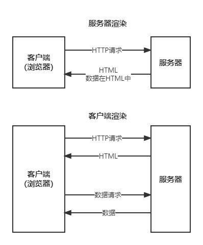
</div>

# 爬虫入门（urllib）
## 第一个爬虫程序
- 简单爬取百度网页

```python
import urllib.request
import urllib.parse

url = "https://baidu.com"

request = urllib.request.Request(url=url)
reponse = urllib.request.urlopen(request).read().decode("utf-8")

print(reponse)
```

### HTTP 协议回顾

1. 一条消息划分为三部分内容

```bash
# 请求
请求行：请求方式（get, post），请求 URL 地址、协议
请求头：放一些服务器要使用的附加信息
请求体：一般放一些请求参数

# 响应
请求行：协议、状态码
请求头：放一些客户端要使用的附加信息
请求体：服务器返回给客户端的内容（HTML,JSON 等）
```

2. 请求头（响应头）中的一些重要内容
    - user-Agent：请求载体的身份标识
    - Referer：防盗链（这个请求从哪个页面来），可用于反爬
    - cookie：本地字符串的数据信息（用户登录信息）

## User-Agent（用户代理）
> User-Agent 即用户代理，简称“UA”，它是一个特殊字符串头。网站服务器通过识别 “UA”来确定用户所使用的操作系统版本、CPU 类型、浏览器版本等信息。而网站服务器则通过判断 UA 来给客户端发送不同的页面。

1. 网站通过识别请求头中 User-Agent 信息来判断是否是爬虫访问网站。如果是，网站首先对该 IP 进行预警，对其进行重点监控，当发现该 IP 超过规定时间内的访问次数，将在一段时间内禁止其再次访问网站
    - 若想更多地了解浏览器 UA 信息(包含移动端、PC端)可参考 [常用浏览器User-Agent](http://tools.jb51.net/table/useragent)

2. python 爬虫默认携带的 UA

```json
"User-Agent": "Python-urllib/3.7"
```

3. 最简单的反爬：重构请求头，向网站发送请求

```python
from urllib import request
# 定义变量：URL 与 headers
url = 'http://httpbin.org/get' #向测试网站发送请求
#重构请求头，伪装成 Mac火狐浏览器访问，可以使用上表中任意浏览器的UA信息
headers = {
'User-Agent':'Mozilla/5.0 (Macintosh; Intel Mac OS X 10.12; rv:65.0) Gecko/20100101 Firefox/65.0'}
# 1、创建请求对象，包装ua信息
req = request.Request(url=url,headers=headers)
# 2、发送请求，获取响应对象
res = request.urlopen(req)
# 3、提取响应内容
html = res.read().decode('utf-8')
print(html)

# 运行结果
{
  "args": {},
  "headers": {
    "Accept-Encoding": "identity",
    "Host": "httpbin.org",
    # 伪装成了Mac火狐浏览器
    "User-Agent": "Mozilla/5.0 (Macintosh; Intel Mac OS X 10.12; rv:65.0) Gecko/20100101 Firefox/65.0",
    "X-Amzn-Trace-Id": "Root=1-6034a52f-372ca79027da685c3712e5f6"
  },
  "origin": "121.17.25.194",
  "url": "http://httpbin.org/get"
}
```

### UA 代理池
> 在编写爬虫程序时，一般都会构建一个 User-Agent （用户代理）池，就是把多个浏览器的 UA 信息放进列表中，然后再从中随机选择。构建用户代理池，能够避免总是使用一个 UA 来访问网站，因为**短时间**内总使用一个 UA **高频率**访问的网站，可能会引起网站的**警觉**，从而封杀掉 IP

```python
ua_list = [
    'Mozilla/4.0 (compatible; MSIE 7.0; Windows NT 5.1; Maxthon 2.0',
    'Mozilla/5.0 (Macintosh; Intel Mac OS X 10_7_0) AppleWebKit/535.11 (KHTML, like Gecko) Chrome/17.0.963.56 Safari/535.11',
    'User-Agent:Opera/9.80 (Windows NT 6.1; U; en) Presto/2.8.131 Version/11.11',
    'Mozilla/5.0 (Windows NT 6.1; rv:2.0.1) Gecko/20100101 Firefox/4.0.1',
    'Mozilla/4.0 (compatible; MSIE 7.0; Windows NT 6.0)',
    'Mozilla/5.0 (Windows; U; Windows NT 6.1; en-us) AppleWebKit/534.50 (KHTML, like Gecko) Version/5.1 Safari/534.50',
    'Mozilla/5.0 (compatible; MSIE 9.0; Windows NT 6.1; Trident/5.0',
    ' Mozilla/4.0 (compatible; MSIE 7.0; Windows NT 5.1',
    'Mozilla/4.0 (compatible; MSIE 6.0; Windows NT 5.1',
    ' Mozilla/5.0 (Macintosh; Intel Mac OS X 10.6; rv:2.0.1) Gecko/20100101 Firefox/4.0.1',
]
```

## URL 编码解码

1. URL 是由一些简单的组件构成，比如协议、域名、端口号、路径和查询字符串等；路径和查询字符串之间使用问号?隔开
2. URL 中规定了一些具有特殊意义的字符，常被用来分隔两个不同的 URL 组件，这些字符被称为保留字符

```
例如：: ? = & / . ... # @ $ + ; %
```

### 哪些字符需要编码

1. URL 之所以需要编码，是因为 URL 中的某些字符会**引起歧义**，比如 URL 查询参数中包含了”&”或者”%”就会造成服务器解析错误；再比如，URL 的编码格式采用的是 **ASCII 码**而非 Unicode 格式，这表明 URL 中不允许包含任何非 ASCII 字符（比如中文），否则就会造成 URL 解析错误
2. 还需要对 URL 中的部分保留字符和不安全字符进行编码

```
ASCII 表中没有对应的可显示字符，例如，汉字。
不安全字符，包括：# ”% <> [] {} | \ ^ ` 。
部分保留字符，即 & / : ; = ? @ 。
```

### Python实现编码与解码

1. python 的标准库 <kbd>urllib.parse</kbd> 模块中提供了用来编码和解码的方法，分别是 <kbd>urlencode()</kbd> <kbd>quote()</kbd> 与 <kbd>unquote()</kbd> 方法

2. 编码 urlencode() 示例

```python
#构建查询字符串字典
query_dict = {
    'wd' : '爬虫'
}
#调用parse模块的urlencode()进行编码
result = parse.urlencode(query_dict)
#使用format函数格式化字符串，拼接url地址
url = 'http://www.baidu.com/s?{}'.format(result)
print(url)

# 结果
"http://www.baidu.com/s?wd=%E7%88%AC%E8%99%AB"
```

3. 编码 quote() 示例

```python
query_string = parse.quote("爬虫")
#使用format函数格式化字符串，拼接url地址
url = 'http://www.baidu.com/s?wd={}'
print(url.format(query_string))

# 结果
"http://www.baidu.com/s?wd=%E7%88%AC%E8%99%AB"
```

- ***注意：quote() 只能对字符串编码，而 urlencode() 可以直接对查询字符串字典进行编码。***

4. 解码 unquote(string) 示例

```python
from urllib import parse
string = '%E7%88%AC%E8%99%AB'
result = parse.unquote(string)
print(result)

# 解码输出
"爬虫"
```

## URL 地址拼接方式

```python
# 1、字符串相加
  baseurl = 'http://www.baidu.com/s?'
  params='wd=%E7%88%AC%E8%99%AB'
  url = baseurl + params
# 2、字符串格式化（占位符）
  params='wd=%E7%88%AC%E8%99%AB'
  url = 'http://www.baidu.com/s?%s'% params
# 3、format()方法
  url = 'http://www.baidu.com/s?{}'
  params='wd=%E7%88%AC%E8%99%AB'
  url = url.format(params)
```

## HTML 页面的解析方式概述
- 总共有三中解析方式帮助解析 HTML 页面
    1. **<font color=#EA5>re 解析</font>**：执行最快，但是编写和逻辑比较复杂
    2. **<font color=#EA5>bs4 解析</font>**：执行较慢，但是比较简便
    3. **<font color=#EA5>xpath 解析</font>**：最流行的防止，效率和复杂度居中

## 爬虫写法
### 爬虫程序结构
- 用面向对象的方法编写爬虫程序时，逻辑结构较为固定

```python
# 程序结构
class xxxSpider(object):
    def __init__(self):
        # 定义常用变量,比如url或计数变量等
       
    def get_html(self):
        # 获取响应内容函数,使用随机User-Agent
   
    def parse_html(self):
        # 使用正则表达式来解析页面，提取数据
   
    def write_html(self):
        # 将提取的数据按要求保存，csv、MySQL数据库等
       
    def run(self):
        # 主函数，用来控制整体逻辑
       
if __name__ == '__main__':
    # 程序开始运行时间
    spider = xxxSpider()
    spider.run()
```

- 具体可以参考 [spider 示例1](spider_get.py)

### 爬虫前需要检查需要爬取的 URL 的三个元素

1. 打开开发人员工具，我们点击“网络”，抓取请求的包，找出需要爬取的包

<div align="center">
    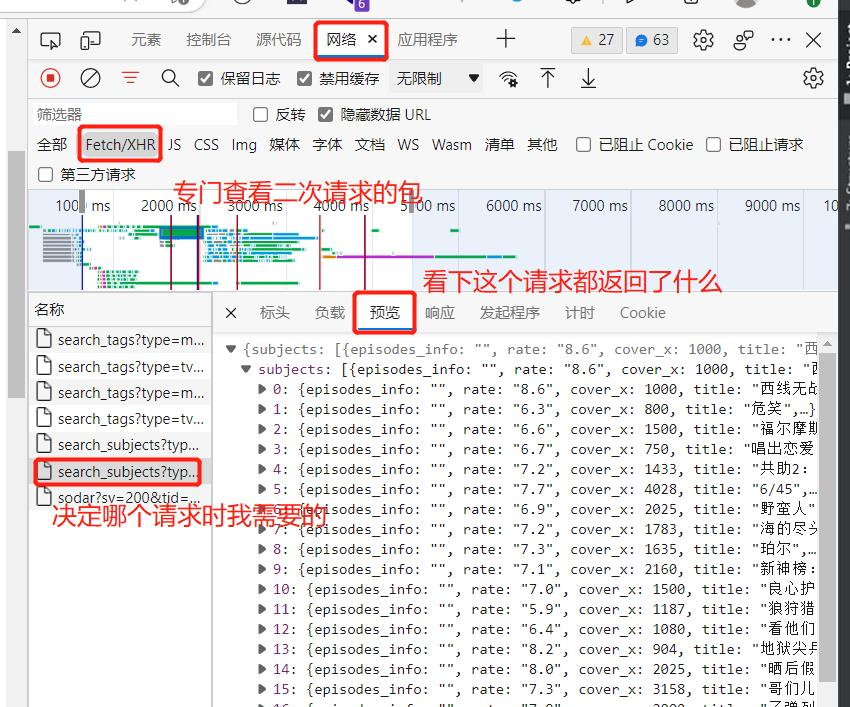
</div>

2. 查看三要素：<kbd>请求URL</kbd>、<kbd>请求方法</kbd>、<kbd>请求参数</kbd>

<div align="center">
    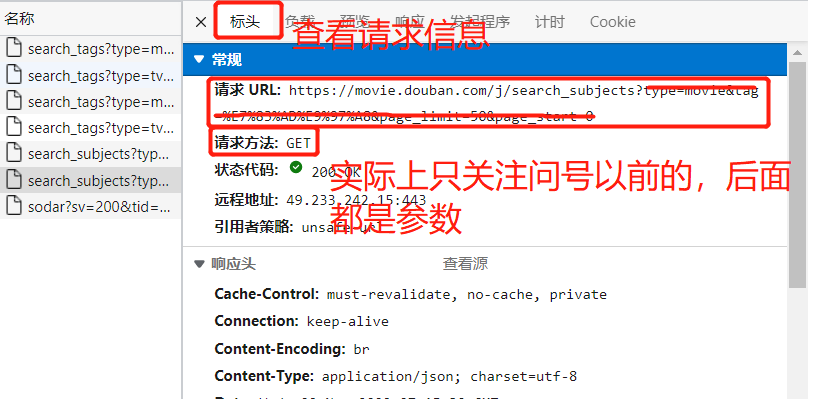
</div>

<div align="center">
    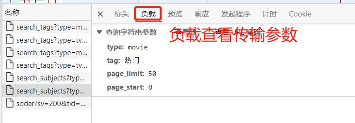
</div>

# Requests 模块
> Requests 是 Python 的第三方库，在 urllib 的基础上开发而来，它使用 Python 语言编写，并且采用了 Apache2 Licensed（一种开源协议）的 HTTP 库。Requests 更加方便、快捷，因此在编写爬虫程序时 Requests 库使用较多。

## 常用请求方法
### requests.get()
1. 该方法用于GET 请求，表示向网站发起请求，主要用于获取页面响应对象
   - url：要抓取的 url 地址。
   - headers：用于包装请求头信息。
   - params：请求时携带的查询字符串参数。
   - timeout：超时时间，超过时间会抛出异常。

```python
res = requests.get(url,headers=headers,params,timeout)
```

2. get 请求传参的方式如下，一般是放在 <kbd>params</kbd> 中

```python
data = {
    'name': '编程帮',
    'url': "www.biancheng.net"
}
response = requests.get('http://httpbin.org/get', params=data)
# get当然也支持直接拼接参数
# response = requests.get(http://httpbin.org/get?name=gemey&age=22)
print(response.text)
```

### requests.post()
1. 该方法用于 POST 请求，先由用户向目标 url 提交数据，然后服务器返回一个 HttpResponse 响应对象

2. POST 请求传参的方式如下，一般是放在 <kbd>data</kbd> 中（称为formData-数据表单）

```python
#百度翻译
url = 'https://fanyi.baidu.com'
#post请求体携带的参数，可通过开发者调试工具查看
#查看步骤：NetWork选项->Headers选项->Form Data
data = {'from': 'zh',
        'to': 'en',
        'query': '编程帮www.biancheng.net你好'
        }
response = requests.post(url, data=data)
print(response)
```

## 原理解析
1. 我们查看 get 请求的源码，发现他确实是基于 urllib 库运行的

```python
return request('get', url, params=params, **kwargs)
```

2. 同时我们发现，原版 request 所带有的参数也是可以通过 request 的方法使用的，例如以下参数

```python
"""
params, data, json: 这三个都是传数据的
files: 传文件
cookies：认证
headers：请求头，UA 等信息就是存在这里
timeout：请求时限
verify：是否需要认证
"""
```
## 一些重要参数
1. SSL 证书是数字证书的一种，类似于驾驶证、护照和营业执照。因为配置在服务器上，也称为 SSL 服务器证书
    - <kbd>verify</kbd> 作用是检查 SSL 证书认证，参数的默认值为 True，如果设置为 False 则表示不检查 SSL证书，此参数适用于没有经过 CA 机构认证的 HTTPS 类型的网站

2. <kbd>proxies</kbd> 
    - 一些网站为了限制爬虫从而设置了很多反爬策略，其中一项就是针对 IP 地址设置的
    - 代理 IP 就是解决上述问题的，它突破了 IP 地址的访问限制，隐藏了本地网络的真实 IP，而使用第三方 IP 代替自己去访问网站
    - 实际使用时可以和 UA 一样构建 **IP代理池**

```python
import requests
​
url = 'http://httpbin.org/get'
headers = {
    'User-Agent':'Mozilla/5.0'
}
# 网上找的免费代理ip
# proxies 参数如下
proxies = {
    'http':'http://191.231.62.142:8000',
    'https':'https://191.231.62.142:8000'
}
html = requests.get(url,proxies=proxies,headers=headers,timeout=5).text
print(html)
```

## Cookie 模拟登录

1. 正常的登录查询操作步骤：
    - 登录 -> 得到 cookies
    - 带着 cookie 进行请求

2. requests 提供了构建 <kbd>Session-会话</kbd> 的方法，我们可以使用 Session 进行请求，Session 请求不会丢失现存的 cookies（Session 是**连续有记录**的）

```python
# 构建 Session
session = requests.Session()
# 登录：pixiv 登录为例
form_data = {
    'pixiv_id': pixiv_id,
    'password': password,
    'return_to': return_to,
}
login_url = 'https://accounts.pixiv.net/login'
res = session.post(url=login_url,
                    headers={'User-Agent': random.choice(ua_list), 'Referer': 'https://www.pixiv.net/'},
                    data=form_data)
# 供后续用 Session 做请求即可
session.get(...)
session.post(...)
...
```

## 防盗链

1. <kbd>盗链</kbd> 是指在自己的页面上展示一些并不在自己服务器上的一些内容， 获取别人的资源地址，绕过别人的资源展示页面，直接在自己的页面上向最终用户提供此内容。一般被盗链的都是图片、 音乐、视频、软件等资源。通过盗链的手段可以减轻自己服务器的负担。

2. <kbd>防盗链</kbd> 的工作原理：通过Refer或者签名，网站可以检测目标网页访问的来源网页，如果是资源文件，则可以追踪到显示他的网页地址 一旦检测到来源不是本站，即进行阻止或者返回指定的页面

3. 防盗链的实现方法：可以通过 nginx 配置实现，具体方法自行查找

4. **<font color=#EA5>防盗链应对方法</font>**：找出对应网站的 Referer，添加到请求头即可

```python
# 例如爬取 pixiv 图片时的 refer
headers={
    'User-Agent': random.choice(ua_list),
    'Referer': 'https://www.pixiv.net/'
},
```


# 正则表达式解析
- 一个简单的例子，检测电话号码：

<div align="center">
    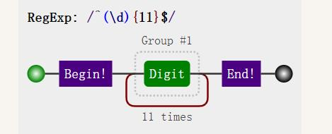
</div>

## 正则表达式语法
### 正则表达式元字符
1. 元字符


|元字符| 匹配内容 |
| ----- | ----------- |
. | 匹配除换行符以外的任意字符
\w|匹配所有普通字符(数字、字母或下划线)
\s|匹配任意的空白符
\d|匹配数字
\n|匹配一个换行符
\t|匹配一个制表符
\b|匹配一个单词的结尾
^|匹配字符串的开始位置
\$|匹配字符串的结尾位置
\W|匹配非字母或数字或下划线
\D|匹配非数字
\S|匹配非空白符
a\|b | 匹配字符 a 或字符 b
\(\)|正则表达式分组所用符号，匹配括号内的表达式，表示一个组。
\[...\]|匹配字符组中的字符
\[^...\]|匹配除了字符组中字符的所有字符


2. 量词

|量词| 用法说明 |
| ----- | ----------- |
*|重复零次或者更多次
+|重复一次或者更多次
？| 重复0次或者一次
\{n\}	| 重复n次
\{n,\}|重复n次或者更多次
\{n,m\}|重复n到m次

3. 字符组

|正则| 待匹配字符 | 匹配结果 | 说明
| ----- | ---- |----|---------|
[0123456789]|8|True|在一个字符组里枚举所有字符，字符组里的任意一个字符；和"待匹配字符"相同都视为可以匹配。
[0123456789]|a|False|由于字符组中没有 "a" 字符，所以不能匹配。
[0-9]|7|True|也可以用-表示范围，[0-9] 就和 [0123456789] 是一个意思。
\[a-z\]|s|True|同样的如果要匹配所有的小写字母，直接用 [a-z] 就可以表示。
\[A-Z\]|B|True|\[A-Z\]|就表示所有的大写字母。
\[0-9a-fA-F\]|e|True|可以匹配数字，大小写形式的 a～f，用来验证十六进制字符。


### 贪婪模式非贪婪模式

- 正则表达式默认为贪婪匹配，也就是尽可能多的向后匹配字符，比如 {n,m} 表示匹配前面的内容出现 n 到 m 次（n 小于 m），在贪婪模式下，首先以匹配 m 次为目标，而在非贪婪模式（惰性匹配）是尽可能少的向后匹配内容，也就是说匹配 n 次即可

- 贪婪模式转换为非贪婪模式的方法很简单，在元字符后添加“?”即可实现
- 例如：

元字符(贪婪模式)|非贪婪模式
| ----- | ---- |
\*|\*\?
+|+？
？|??
{n,m}|{n,m}？

### 正则表达式转义
- 如果使用正则表达式匹配特殊字符时，则需要在字符前加 <kbd>\\</kbd> 表示转意。常见的特殊字符如下

```
* + ? ^ $ [] () {} | \
```

## Re 模块

> Re 是 python 中正则解析的模块；在线正则表达式测试、生成代码网站：https://c.runoob.com/front-end/854/ 

1. <kbd>findall</kbd>：根据正则表达式匹配目标字符串内容，返回多个可用匹配

```python
lst = re.findall(r"\d+", "苏：18024107449, 郑：18023232222")
print(lst)
# 输出
['18024107444', '18023232222']
```

2. <kbd>finditer</kbd>：根据正则表达式匹配目标字符串内容，返回一个迭代器而不是直接 list，迭代器中为 match 对象

```python
iter = re.finditer(r"\d+", "苏：18024107449, 郑：18023232222")
for item in iter:
    # 从 match 对象拿到内容需要group
    print(item.group())
# 输出一样
```

3. <kbd>search</kbd>：匹配目标字符串第一个符合的内容，返回值为匹配的字符串 match 对象

```python
iter = re.search(r"\d+", "苏：18024107449, 郑：18023232222")
print(iter.group())
# 输出
'18024107444'
```

4. <kbd>match</kbd>：**从头**开始匹配目标字符串，返回值为匹配的对象

```python
iter = re.match(r"\d+", "苏：18024107449, 郑：18023232222")
print(iter.group())
# 输出
<报错，没有>

iter = re.match(r"\d+", "18024107449, 郑：18023232222")
print(iter.group())
# 输出
'18024107449'
```

5. <kbd>split</kbd>：该函数使用正则表达式匹配内容，切割目标字符串。返回值是切割后的内容列表

```python
iter = re.split(r"\d+", "苏：18024107449, 郑：18023232222")
print(iter)
# 输出
['苏：', ', 郑：', '']
```

6. <kbd>compile</kbd>：该方法用来生成正则表达式对象，相当于内存预加载正则表达式

```python
regex = re.compile(r"\d+")
# 使用预加载的正则表达式
iter = regex.finditer("苏：18024107449, 郑：18023232222")
```

## Re 模块网页信息提取

1. 按照规律捕捉 HTML 标签信息的示例

```python
import re
html="""
<div><p>www.biancheng.net</p></div>
<div><p>编程帮</p></div>
"""
#贪婪匹配，re.S可以匹配换行符
#创建正则表达式对象
pattern=re.compile('<div><p>.*</p></div>',re.S)
#匹配HTMLX元素，提取信息
re_list=pattern.findall(html)
print(re_list)
#非贪婪模式匹配，re.S可以匹配换行符
pattern=re.compile('<div><p>.*?</p></div>',re.S)
re_list=pattern.findall(html)
print(re_list)

# 输出结果
['<div><p>www.biancheng.net</p></div>\n<div><p>编程帮</p></div>']
['<div><p>www.biancheng.net</p></div>', '<div><p>编程帮</p></div>']
```

2. 不需要标签，只需要标签中的信息，我们可以用 <kbd>(?P<内容名字>内容)</kbd> 的方式提取内容

```python
import re

html = """
<div class="movie-item-info">
    <p class="name">
        <a title="你好，李焕英">你好，李焕英</a>
    </p>
    <p class="star">
        主演：贾玲,张小斐,沈腾
    </p>    
</div>
<div class="movie-item-info">
    <p class="name">
        <a title="刺杀，小说家">刺杀，小说家</a>
    </p>
    <p class="star">
        主演：雷佳音,杨幂,董子健,于和伟
    </p>    
</div> 
"""

pattern = re.compile('<div.*?<p.*?<a.*?>(?P<title>.*?)</a>.*?</p>.*?<p.*?>(?P<stars>.*?)</p>.*?</div>', re.S)
lst = pattern.findall(html)

if lst:
    print(20 * "*")
    for info in  lst:
        print("影片名称：", info[0])
        print("影片{}".format(info[1].strip()))
        print(20*"*")
# 输出
"""
********************
影片名称： 你好，李焕英
影片主演：贾玲,张小斐,沈腾
********************
影片名称： 刺杀，小说家
影片主演：雷佳音,杨幂,董子健,于和伟
********************
"""
```

3. 其他方法

<div align="center">
    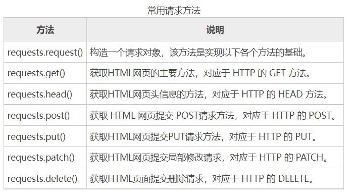
</div>

### 标签定位的小秘诀
1. 建议锁定目标爬取数据后，再往上数几层标签作为基准匹配
2. 标签如 \<div\> 之间很可能有空格、换行等特殊字符，我们直接使用 .*? 匹配这中间的大量内容
3. class="..." 可以做精确定位，包括一些 title="..." 等特殊字符串也可以做精确定位


# BS解析
> Beautiful Soup 简称 BS4（其中 4 表示版本号）是一个 Python 第三方库，它可以从 HTML 或 XML 文档中快速地提取指定的数据。Beautiful Soup 语法简单，使用方便，并且容易理解。

## B常用语法
1. Beautiful Soup 将 HTML 文档转换成一个树形结构，该结构有利于快速地遍历和搜索 HTML 文档。

```html
<html>
    <head>
        <title>c语言中文网</title>
    </head>
    <body>
        <h1>c.biancheng.net</h1>
        <p><b>一个学习编程的网站</b></p>
    </body>
</html>
```

<div align="center">
    
</div>

2. 文档树中的每个节点都是 Python 对象，这些对象大致分为四类：Tag , NavigableString , BeautifulSoup , Comment 。其中使用最多的是 Tag 和 NavigableString
    - tag：标签类，HTML 文档中所有的标签都可以看做 Tag 对象。
    - NavigableString：字符串类，指的是标签中的文本内容，使用 text、string、strings 来获取文本内容。
    - BeautifulSoup：表示一个 HTML 文档的全部内容，您可以把它当作一个人特殊的 Tag 对象。
    - Comment：表示 HTML 文档中的注释内容以及特殊字符串，它是一个特殊的 NavigableString。


## 常用方法

### find_all
- 方法用来搜索当前 tag 的所有子节点，并判断这些节点是否符合过滤条件，最后以列表形式将符合条件的内容返回

1. find_all( name , attrs , recursive , text , limit )：
    - name：查找所有名字为 name 的 tag 标签，字符串对象会被自动忽略。
    - attrs：按照属性名和属性值搜索 tag 标签，注意由于 class 是 Python 的关键字吗，所以要使用 "class_"。
    - recursive：find_all() 会搜索 tag 的所有子孙节点，设置 recursive=False 可以只搜索 tag 的直接子节点。
    - text：用来搜文档中的字符串内容，该参数可以接受字符串 、正则表达式 、列表、True。
    - limit：由于 find_all() 会返回所有的搜索结果，这样会影响执行效率，通过 limit 参数可以限制返回结果的数量。

2. 用例：爬取贴吧的帖子信息

```python
# 标签属性法
# bs解析
page = BeautifulSoup(html, "html.parser")
# bs 对象查找数据
# class 是 python 关键字，我们需要加个下划线区分
contents = page.find_all("div", class_="t_con cleafix")
for c in contents:
    # 标题
    title = c.find("a", class_="j_th_tit")
    title = title['title']
```

3. 正则表达式、列表，以及 True 也可以当做过滤条件
```python
# 列表行书查找tag标签
print(soup.find_all(['b','a']))
# 正则表达式匹配id属性值
print(soup.find_all('a',id=re.compile(r'.\d')))
# True可以匹配任何值，下面代码会查找所有tag，并返回相应的tag名称
for tag in soup.find_all(True):
    print(tag.name,end=" ")
# 输出所有以 “” 开始的tag标签
for tag in soup.find_all(re.compile("^b")):
    print(tag.name)
```

4. BS4 为了简化代码，为 find_all() 提供了一种简化写法

```python
# 简化前
soup.find_all("a")
# 简化后
soup("a")
```

### find

- 不同之处在于 find_all() 会将文档中所有符合条件的结果返回，而 find() 仅返回一个符合条件的结果，所以 find() 方法没有limit参数
- 使用 find() 时，如果没有找到查询标签会返回 None，而 find_all() 方法返回空列表

```python
# 创建soup解析对象
soup = BeautifulSoup(html_doc, 'html.parser')
# 查找第一个a并直接返回结果
print(soup.find('a'))
# 查找title
print(soup.find('title'))
# 匹配指定href属性的a标签
print(soup.find('a',href='http://c.biancheng.net/python/'))
# 根据属性值正则匹配
print(soup.find(class_=re.compile('tit')))
# attrs参数值
print(soup.find(attrs={'class':'vip'}))
```

### 遍历节点

- Tag 对象提供了许多遍历 tag 节点的属性，比如 contents、children 用来遍历子节点；parent 与 parents 用来遍历父节点；而 next_sibling 与 previous_sibling 则用来遍历兄弟节点

```python
from bs4 import BeautifulSoup

html_doc = """
<html><head><title>"c语言中文网"</title></head>
<body>
<p class="title"><b>c.biancheng.net</b></p>
<p class="website">一个学习编程的网站</p>
<a href="http://c.biancheng.net/python/" id="link1">python教程</a>,
<a href="http://c.biancheng.net/c/" id="link2">c语言教程</a> and
"""
soup = BeautifulSoup(html_doc, 'html.parser')
body_tag = soup.body
p_tag = body_tag.p
# print(body_tag)
print(body_tag.contents)
print(p_tag.parent)
for child in body_tag.children:
    print(str(child).strip())

# 输出
# body_tag.contents
['\n', <p class="title"><b>c.biancheng.net</b></p>, '\n', <p class="website">一个学习编程的网站</p>, '\n', <a href="http://c.biancheng.net/python/" id="link1">python教程</a>, ',\n', <a href="http://c.biancheng.net/c/" id="link2">c语言教程</a>, ' and\n']
# p_tag.parent
<body>
<p class="title"><b>c.biancheng.net</b></p>
<p class="website">一个学习编程的网站</p>
<a href="http://c.biancheng.net/python/" id="link1">python教程</a>,
<a href="http://c.biancheng.net/c/" id="link2">c语言教程</a> and
</body>
# body_tag.children
<p class="title"><b>c.biancheng.net</b></p>
<p class="website">一个学习编程的网站</p>
<a href="http://c.biancheng.net/python/" id="link1">python教程</a>
<a href="http://c.biancheng.net/c/" id="link2">c语言教程</a>
```

# Xpath
> 在编写爬虫程序的过程中提取信息是非常重要的环节，但是有时使用正则表达式无法匹配到想要的信息，或者书写起来非常麻烦，此时就需要用另外一种数据解析方法，也就是本节要介绍的 <kbd>Xpath 表达式</kbd>

## Xpath表达式
1. XPath（全称：XML Path Language）即 XML 路径语言，它是一门在 XML 文档中查找信息的语言
    - XML 是一种遵守 W3C 标椎的标记语言，类似于 HTML，但两者的设计目的是不同，XML 通常被用来传输和存储数据，而 HTML 常用来显示数据

2. Xpath 使用路径表达式来选取XML/HTML文档中的节点或者节点集。Xpath 的功能十分强大，它除了提供了简洁的路径表达式外，还提供了100 多个内建函数，包括了处理字符串、数值、日期以及时间的函数。因此 Xpath 路径表达式几乎可以匹配所有的元素节点。

## Xpath节点
1. XPath 提供了多种类型的节点，常用的节点有：元素、属性、文本、注释以及文档节点

```xml
<?xml version="1.0" encoding="utf-8"?>
<website>
<site>
  <title lang="zh-CN">website name</title>
  <name>编程帮</name>
  <year>2010</year>
  <address>www.biancheng.net</address>
</site>
</website>
```

- 上面的 XML 文档中的节点

```xml
<website></website> （文档节点）
<name></name> （元素节点）
lang="zh-CN" （属性节点） 
```

2. XML 文档的节点关系和 HTML 文档相似，同样有父、子、同代、先辈、后代节点

## Xpath 基本语法
1. Xpath 使用路径表达式在文档中选取节点，下表列出了常用的表达式规则

<div align="center">
    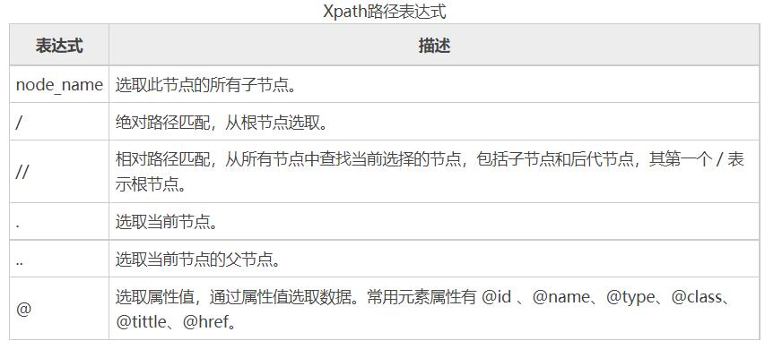
</div>

```xml
<ul class="BookList">
  <li class="book1" id="book_01" href="http://www.biancheng.net/">
        <p class="name">c语言小白变怪兽</p>
        <p class="model">纸质书</p>
        <p class="price">80元</p>
        <p class="color">红蓝色封装</p>
    </li>
  
    <li class="book2" id="book_02" href="http://www.biancheng.net/">
        <p class="name">Python入门到精通</p>
        <p class="model">电子书</p>
        <p class="price">45元</p>
        <p class="color">蓝绿色封装</p>
    </li>
</ul>
```

```
xpath表达式：//li/p[@class="name"]
匹配内容：
c语言小白变怪兽
Python入门到精通


xpath表达式：//li/p[@class="model"]
匹配内容：
纸质书
电子书

xpath表达式：//ul/li/@href
匹配内容：
http://www.biancheng.net/
http://www.biancheng.net/
```

2. xpath通配符：Xpath 表达式的通配符可以用来选取未知的节点元素，基本语法如下

<div align="center">
    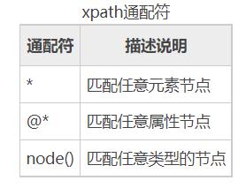
</div>

```
xpath表达式：//li/*

匹配内容：
c语言小白变怪兽
纸质书
80元
红蓝色封装
Python入门到精通
电子书
45元
蓝绿色封装
```

3. 多个 Xpath 路径表达式可以同时使用，用 // 间隔即可

```
表达式：//ul/li[@class="book2"]/p[@class="price"]|//ul/li/@href

匹配内容：
45元
http://www.biancheng.net/
http://www.biancheng.net/
```

4. Xpath内建函数：Xpath 提供 100 多个内建函数，这些函数给我们提供了很多便利，比如实现文本匹配、模糊匹配、以及位置匹配等
    - 写表达式的时候何以直接内嵌这些函数

<div align="center">
    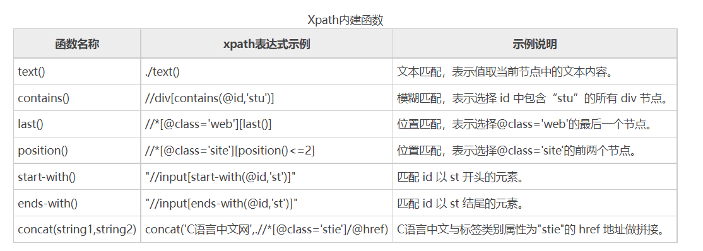
</div>


## lxml 工具使用
> lxml 是 Python 的第三方解析库，完全使用 Python 语言编写，它对 Xpath 表达式提供了良好的支持，因此能够了高效地解析 HTML/XML 文档

1. lxml 库提供了一个 etree 模块，该模块专门用来解析 HTML/XML 文档

```python
from lxml import etree
html_str = '''
<div>
    <ul>
         <li class="item1"><a href="link1.html">Python</a></li>
         <li class="item2"><a href="link2.html">Java</a></li>
         <li class="site1"><a href="c.biancheng.net">C语言中文网</a>
         <li class="site2"><a href="www.baidu.com">百度</a></li>
         <li class="site3"><a href="www.jd.com">京东</a></li>
     </ul>
</div>
'''
tree = etree.HTML(html_str)
# 构建可使用 XPATH 表达式检索内容的一个 tree 对象
```

2. lxml 对象调用 xpath 表达式

```python
title = tree.xpath("//ul/li/a/text()")
print(title)
# 输出
['Python', 'Java', ...]
```

## 浏览器插件 XPATH-HELPER
> Xpath Helper 是一款谷歌应用商店推出的免费工具

1. 安装插件：浏览器应用商店安装即可
2. 快捷键 <kbd>ctril+shift+x</kbd> 弹出xpath-helper窗口，将鼠标悬停在需要选取数据的文本上，并按下shift按键就会自动出现 Xpath 表达式
3. 可以通过修改 bar.js 和 content.js 两个文件来修改快捷键

```js
// Constants.
var RELOCATE_COOLDOWN_PERIOD_MS = 400;
var X_KEYCODE = 90; // 88 改 90 就是 ctril+shift+z
```

# python 爬虫提效
> 网络爬虫程序是一种 IO 密集型程序，程序中涉及了很多网络 IO 以及本地磁盘 IO 操作，这些都会消耗大量的时间，从而降低程序的执行效率，而 Python 提供的多线程能够在一定程度上提升 IO 密集型程序的执行效率

## 多线程
### python 多线程使用

- Python 提供了两个支持多线程的模块，分别是 _thread 和 threading。其中 _thread 模块偏底层，它相比于 threading 模块功能有限，因此推荐大家使用 threading 模块。 threading 中不仅包含了  _thread 模块中的所有方法，还提供了一些其他方法，如下所示：
    - threading.currentThread() 返回当前的线程变量。
    - threading.enumerate() 返回一个所有正在运行的线程的列表。
    - threading.activeCount() 返回正在运行的线程数量。

1. 创建线程
    - <kbd>start</kbd> 并没有马上启动线程，只是告诉线程可以开始了，CPU决定具体执行时间

```python
from threading import Thread

​#线程创建、启动、回收
t = Thread(target=函数名, args=(参数1,参数2,...)) # 创建线程对象
t.start() # 创建并启动线程
t.join()  # 阻塞等待回收线程
```

2. 创建多线程

```python
t_list = []
for i in range(5):
    t = Thread(target=函数名)
    t_list.append(t)
    t.start()
for t in t_list:
    t.join()
```

3. 在处理线程的过程中要时刻注意线程的同步问题，即多个线程不能操作同一个数据，否则会造成数据的不确定性。通过 threading 模块的 Lock 对象能够保证数据的正确性。
    - 比如，使用多线程将抓取数据写入磁盘文件，此时，就要对执行写入操作的线程加锁，这样才能够避免写入的数据被覆盖。当线程执行完写操作后会主动释放锁，继续让其他线程去获取锁，周而复始，直到所有写操作执行完毕。

```python
from threading import Lock
lock = Lock()
# 获取锁
lock.acquire()
# 操作数据
... ...
# 释放锁
lock.release()
```

- 注意： 
    1. <kbd>thred.run()</kbd> 方法是单线程运行，不会创建线程
    2. <kbd>start(target=函数名)</kbd> 中填写的函数名不应带有(...)，否则不创建新线程！

### Queue 队列存取共享数据
1. 对于 Python 多线程而言，由于 GIL 全局解释器锁的存在，同一时刻只允许一个线程占据解释器执行程序，当此线程遇到 IO 操作时就会主动让出解释器，让其他处于等待状态的线程去获取解释器来执行程序，而该线程则回到等待状态，这主要是通过**线程的调度**机制实现的。

2. 由于上述原因，我们需要构建一个多线程共享数据的模型，让所有线程都到该模型中获取数据。queue（队列，先进先出） 模块提供了创建共享数据的队列模型。
    - **比如，把所有待爬取的 URL 地址放入队列中，每个线程都到这个队列中去提取 URL。**
    - <kbd>Queue</kbd> 队列自带数据锁

<div align="center">
    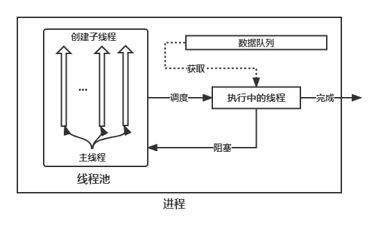
</div>

```python
# 获取每一 p 视频的下载链接
for p in range(p_num-97):
    print("正在获取视频第{}P下载链接".format(p+1))
    p_url = home_url + "/?p={}".format(p+1)
    VideoUrl, AudioUrl = getVideoUrl(p_url)
    videoUrlList.put(VideoUrl)

# 下载每一 p 视频
videoName = "_video_{}.mp4".format(p+1)
BiliBiliDownload(homeUrl, vList.get(), videoName, session)
```

### python 线程池

- **<font color=#EA5>线程池</font>**：一次性开辟一些线程，我们用户直接给线程池提交任务；使用线程池可以限定同时执行的线程个数，并且主线程会等到所有线程执行结束后执行

1. 使用线程池

```python
# import 线程池和进程池
from concurrent.futures import ThreadPoolExecutor, ProcessPoolExecutor

# 定义线程池并且执行任务
with ThreadPoolExecutor(max_workers=2) as ts:
    for i in range(3):
        # 启动线程
        task = ts.submit(runGet)
```

2. <kbd>wait</kbd> 接收三个参数
    - fs: 表示需要执行的序列
    - timeout: 等待的最大时间，如果超过这个时间即使线程未执行完成也将返回
    - return_when：表示 wait 返回结果的条件，默认为 ALL_COMPLETED 全部执行完成再返回

```python
with ThreadPoolExecutor(max_workers=5) as t: 
    all_task = [t.submit(spider, page) for page in range(1, 5)]
    # 这里是等待一个线程完成后执行主线程
    wait(all_task, return_when=FIRST_COMPLETED)
    print('finished')

# 运行结果
crawl task1 finished
finished
crawl task2 finished
crawl task3 finished
crawl task4 finished
```

## 协程

### 协程概念

> 在程序处理 IO （网络请求，读写文件）时，我们的程序都处于阻塞状态，等待请求完成；<kbd>协程</kbd> 就是让程序在等待的时候可以干别的事情，提高运行效率

1. **<font color=#EA5>协程</font>**：在微观上，就是任务之间进行切换，切换条件一般是 IO 操作；在宏观上，我们看到的就是多个任务一起在执行；表现形式是 <kbd>多任务异步操作</kbd>（单线程条件下）

2. 为什么使用协程：
    - 多线程的缺陷是切换、调度成本高昂，系统能容纳的线程数量也很有限
    - 协程并没有增加线程数量，只是在线程的基础之上通过分时复用的方式运行多个协程（本质单线程）
    - IO 密集型任务使用协程节省资源

### 实现协程 asyncio

1. 这里介绍最受欢迎的方式 <kbd>asyncio + async/await</kbd>：
    - 为了简化并更好地标识异步IO，从Python3.5开始引入了新的语法async和await，可以让coroutine的代码更简洁易读
    - 实际上是把 asyncio 的 @asyncio.coroutine 替换为 async；把yield from 替换为 await

2. 使用很方便，在函数定义前加上 async 即可表示为异步方法，使用 asuncio.run 调用即可
    - 被 async 标记的方法不能直接调用

```python
import asyncio

async def function(i):
    print("function_front_{}".format(i))
    time.sleep(2)
    print("function_back_{}".format(i))

# 单个任务
if __name__ == '__main__':
    # 1. 直接取函数得到一个协程对象
    f = function(1)
    # 2. 跑协程对象
    asyncio.run(f)

# 多个任务
if __name__ == '__main__':
    # 1. 直接取函数得到协程对象列表
    tasks = [function(i) for i in range(3)]
    # 2. 一次性启动多个 task（异步）
    asyncio.run(asyncio.wait(tasks))
```
- 上述直接运行的程序跑出来的效果是同步的，因为程序中出现了同步操作 <kbd>time.sleep</kbd>，这里可以换成 <kbd>await asyncio.sleep</kbd> 达到异步的效果（await 是挂起，必须要），相当于模拟 IO

```python
async def function(i):
    print("function_front_{}".format(i))
    await asyncio.sleep(i)
    print("function_back_{}".format(i))

if __name__ == '__main__':
    # 1. 直接取函数得到一个协程对象
    tasks = [function(i+1) for i in range(3)]
    # 2. 一次性启动多个 task（异步）
    start = time.time()
    asyncio.run(asyncio.wait(tasks))
    end = time.time()
    print("执行时间：{:.3}".format(end - start))

# 输出
function_front_2
function_front_1
function_front_3
function_back_1
function_back_2
function_back_3
执行时间：3.02
```

3. 规范一下使用这种方法的程序写法
    - python 3.8 后需要使用 <kbd>asyncio.create_task</kbd> 创建 task 对象（包装）

```python
import asyncio
import time

async def function(i):
    ... ...

async def main():
    """
    协程主函数
    """
    # 1. 得到一个协程列表
    # asyncio.create_task 创建任务
    tasks = [asyncio.create_task(function()) for i in range(3)]
    # 2. 挂起协程操作（执行）
    await asyncio.wait(tasks)

if __name__ == '__main__':
    # 3. 调用协程主函数
    asyncio.run(main())
```

### 实现协程 Gevent

1. Gevent是一个基于Greenlet实现的网络库，通过greenlet实现协程。基本思想是一个greenlet就认为是一个协程，当一个greenlet遇到IO操作的时候，比如访问网络，就会自动切换到其他的greenlet，等到IO操作完成，再在适当的时候切换回来继续执行。

2. 使用 Gevent，使用时平时是顺序运行，要让greenlet交替运行，可以通过gevent.sleep()交出控制权

```python
def function(i):
    print("function_front_{}".format(i))
    gevent.sleep(i)
    print("function_back_{}".format(i))

def main():
    """
    协程主函数
    :return:
    """
    # 1. 直接取函数得到一个协程列表
    tasks = [gevent.spawn(function, i+1) for i in range(3)]
    # 2. 挂起协程操作（执行）
    for t in tasks:
        t.join()
```

3. 在实际的代码里，我们不会用gevent.sleep()去切换协程，而是在执行到IO操作时gevent会自动完成，所以gevent需要将Python自带的一些标准库的运行方式由阻塞式调用变为协作式运行。这一过程在启动时通过 <kbd>monkey patch</kbd> 完成

```python
from gevent import monkey
monkey.patch_all()

# 各种 IO 任务
... ...
```

# Selenium
> Selenium 是一个用于测试 Web 应用程序的自动化测试工具，它直接运行在浏览器中，实现了对浏览器的自动化操作，它支持所有主流的浏览器，包括 IE，Firefox，Safari，Chrome 等。
> 
> 关于 Selenium IDE/Grid 的相关知识可参考官网文档 https://www.selenium.dev/。

## 安装 Selenium
1. python 环境

```python
pip install Selenium
```

2. 安装浏览器驱动：若想使 Selenium 能够调用浏览器，那么必须通过 webdriver 驱动来实现。不同的浏览器需要使用不同驱动程序，下面列出了不同浏览器驱动程序的下载地址：
    - [谷歌浏览器 chromedrive](http://chromedriver.storage.googleapis.com/index.html)
    - [火狐浏览器 geckodriver](https://github.com/mozilla/geckodriver/releases)
    - [Edge 浏览器](https://developer.microsoft.com/en-us/microsoft-edge/tools/webdriver/)
    - [IE 浏览器 IEDriver](http://selenium-release.storage.googleapis.com/index.html)

- 各种浏览器的驱动安装规程基本一致。不过需要注意：安装 Chrome、Firefox 驱动时，需要下载与浏览器版本相匹配的驱动程序，否则不能驱动浏览器。

- 可以在设置中查看浏览器版本号，下载对应版本号的驱动即可

<div align="center">
    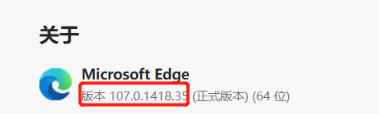
</div>

3. 浏览器驱动需要解压后放入 python 环境当中（python.exe 或 python 解释器所在的根目录），它是一个可执行文件
    - 你可以通过环境变量查找到它在哪，也可以使用指令查找

<div align="center">
    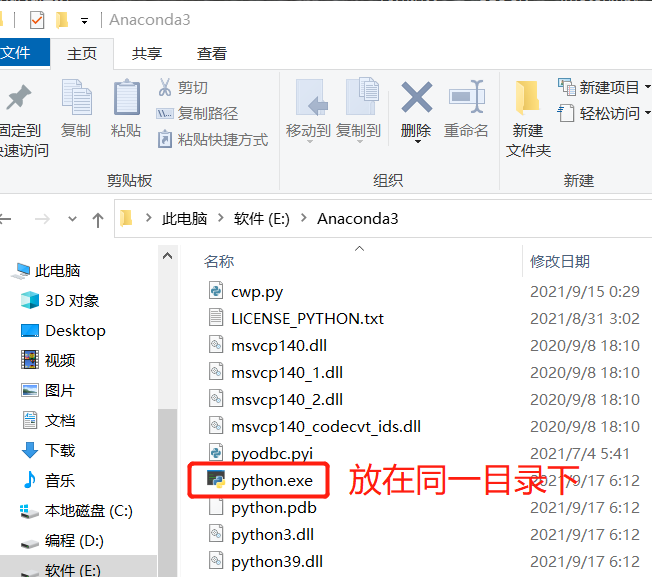
</div>

## 元素定位（抓钩）
1. 3.8 python 以后我们直接使用 <kbd>find_element(By, value)</kbd> 定位元素

```python
# 源码中 by 的类别
class By:
    """
    Set of supported locator strategies.
    """

    ID = "id"
    XPATH = "xpath"
    LINK_TEXT = "link text"
    PARTIAL_LINK_TEXT = "partial link text"
    NAME = "name"
    TAG_NAME = "tag name"
    CLASS_NAME = "class name"
    CSS_SELECTOR = "css selector"
```

2. 自动化打开浏览器后查找元素

```python
# 导入seleinum webdriver接口
from selenium import webdriver
from selenium.webdriver.common.by import By

browser = webdriver.Edge()
# 访问网站
browser.get('https://v3.lt-edu.net/login.html#/login')
# 查找元素
el = browser.find_element(By.XPATH, r'//*[@id="app"]/div/div[1]/div/div[3]/div[2]/div[1]/div/input')
```

3. tips：
    - 一般采用 xpath 获取元素的，“开发者工具” 复制即可
    - 获取页面的时候建议 sleep 一下，不然可能没有加载出来就执行了后面的语句

4. 获取元素属性

```python
# 文本
el.text
# size
el.size
# ...
```

## 控制浏览器操作
### 控制浏览器
1. 设置浏览器窗口大小、位置

```python
# 参数数字为像素点
driver.set_window_size(480, 800)
# 设置窗口位置
driver.set_window_position(100,200)
# 同时设置窗口的大小和坐标
driver.set_window_rect(450,300,32,50)
# 最大化浏览器窗口
driver.maximize_window()
# 退出浏览器
driver.quit()
```

2. 控制网页前进、后退、刷新页面

```python
# 返回（后退）
driver.back()
# 前进
driver.forward()
# 刷新当前页面相当于F5
driver.refresh() 
# 关闭页面
driver.close()
# 退出/关闭浏览器
driver.quit()
```

3. 切换窗口

```python
# 切换窗口（转至最后一个）
# browser.window_handles 获取窗口列表
driver.switch_to.window(browser.window_handles[-1])
```

### 鼠标操作
1. 获取到元素之后可以进行的最简单的操作，就是 <kbd>click</kbd>

```python
el.click()
```

2.  ActionChains：Selenium WebDriver 将关于鼠标的操作方法都封装在 ActionChains 类中，使用时需要引入 ActionChains 类

<div align="center">
    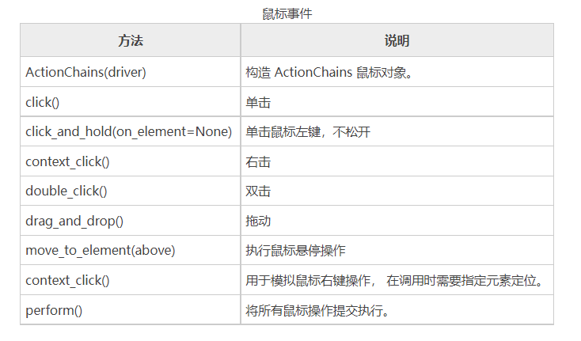
</div>

3.  ActionChains 的示例

- 基本示例
```python
from selenium import webdriver
# 导入 ActionChains 类
from selenium.webdriver.common.action_chains import ActionChains
driver = webdriver.Chrome()
driver.get("http://url.net")
# 通过xpath表达式定位到要悬停的元素
above = driver.find_element_by_xpath('...')
# 对定位到的元素执行鼠标悬停操作
ActionChains(driver).move_to_element(above).perform()
```

- 拖动鼠标（适用于滑动验证）

```python
# 找到验证按钮
button = browser.find_element(By.XPATH, r'//*[@id="app"]/div/div[1]/div/div[3]/div[2]/div[4]/div/div[3]')
# 创建 ActionChains
action = ActionChains(browser)
# 拖动那个按钮
action.click_and_hold(button).perform()
action.move_by_offset(200, 0).perform()
```


### 键盘操作
1. 回车提交：<kbd>submit</kbd> 实际上就是回车的效果

```python
el.submit()
```

2. Selenium  WebDriver 的 Keys 模块提供了模拟键盘输入的 send_keys() 方法，除此之外，该模块也提供了操作键盘的其他方法，比如复制、粘贴

<div align="center">
    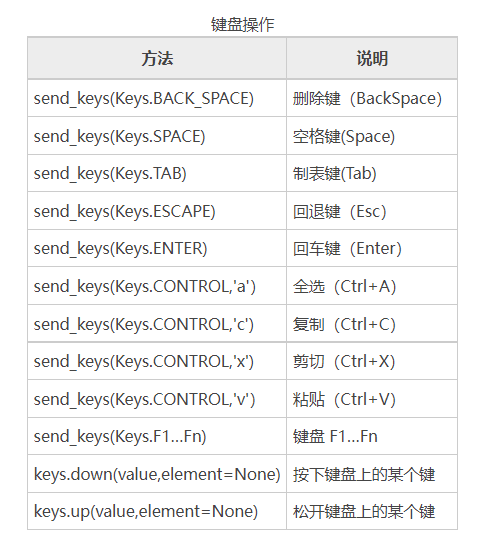
</div>

```python
# 输入框输入内容
driver.find_element_by_id("kw").send_keys("C语言中文网H")
# 删除多输入的一个H
driver.find_element_by_id("kw").send_keys(Keys.BACK_SPACE)
# 单击“百度”一下查找
driver.find_element_by_id("su").click()

# 输入空格键 + “Python教程”
driver.find_element_by_id("kw").send_keys(Keys.SPACE)
driver.find_element_by_id("kw").send_keys("Python教程")
# ctrl+a 全选输入框内容
driver.find_element_by_id("kw").send_keys(Keys.CONTROL, 'a')
# ctrl+x 剪切输入框内容
driver.find_element_by_id("kw").send_keys(Keys.CONTROL, 'x')
# ctrl+v 粘贴内容到输入框
driver.find_element_by_id("kw").send_keys(Keys.CONTROL, 'v')
# 使用回车键来代替单击操作click
driver.find_element_by_id("su").send_keys(Keys.ENTER)
```

### 页面等待

- 为什么需要等待：当你点击搜索按钮后，页面刷新至少 0.1s，此时我们要等到搜索动作执行完成后再进行操作

```python
# 导入专用包 WebDriverWait
from selenium.webdriver.support.wait import WebDriverWait
# 如下例子为
# 等待最多2s，直到使用 XPATH 方法查找到这元素之后才结束等待，并且得到元素
el = WebDriverWait(driver, 2).until(EC.presence_of_element_located(
    (By.XPATH, r'//*[@id="app"]/div[1]/div[1]/div[1]/i')
))
```

1. <kbd>WebDriverWait(driver, timeout, poll_frequency)</kbd>:
    - driver: 驱动
    - timeout: 等待超时时限
    - poll_frequency: 检测频率，默认每 0.5s 检测一次

2. <kbd>expected_conditions</kbd>: 可以对网页上元素进行判断，一般配合 WebDriverWait 使用
    - title_is(): 判断当前页面的标题是否等于预期，返回布尔值
    - title_contains(): 判断当前页面的标题是否包含预期字符串
    - presence_of_element_located(): 判断元素是否被加在DOM树里，并不代表该元素一定可见
    - visibility_of_element_located(): 判断元素是否可见（可见代表元素非隐藏，并且元素的宽和高都不等于0）
    - presence_of_all_element_located(): 判断是否至少有一个元素存在DOM树中
    - text_to_be_present_in_element(): 判断某个元素中的 text 是否包含了预期的字符串
    - text_to_be_present_in_element_value(): 判断某个元素中的 value 属性是否包含了预期字符串
    - frame_to_be_available_and_switch_to_it(): 判断该表单是否可以切换进去，如果可以，返回 True 并 switch 进去，否则返回 False
    - invisibility_of_element_located(): 判断某个元素是否不存在与DOM树中或不可见
    - invisibility_of_element_located(): 判断某个元素是否不存在与DOM树中或不可见
    - element_to_be_selected(): 判断某个元素是否被选中，一般用在下拉列表，传入 element 元素
    - element_selection_state_to_be(): 判断某个元素的选中状态是否符合预期，方法参数是element和 is_selected
    - element_located_selection_state_to_be(): 与element_selection_state_to_be()作用一样，只是方法参数不同，方法参数是located和 is_selected
    - alert_is_present(): 按断页面上是否存在alert警告


## 无界面浏览器
> Chromedriver 每一次运行都要打开浏览器，并执行相应的输入、搜索等操作，这样会导致浏览器交互能力变差，浪费许多时间。 Selenium 为了增强浏览器的交互能力，允许您使用无头浏览器模式，也就是无界面浏览器，它被广泛的应用于爬虫和自动化测试中。

### 如何使用

1. <kbd>option</kbd> ： 通过以下代码可以设置无头浏览器模式

```python
from selenium import webdriver
import time
# option 对象
options = webdriver.ChromeOptions()
# 无界面浏览
options.add_argument('--headless')
# 不显示
options.add_argument('--disable-gpu')
# 根据 option 配置打开 driver
driver = webdriver.Chrome(options=options)
driver.get('https://www.baidu.com')
```

2. 除了可以设置无头界面之外，Selenium 还支持其他一些浏览器参数设置

```python
opption.add_argument('--window-size=600,600') # 设置窗口大小
opption.add_argument('--incognito') # 无痕模式
opption.add_argument('--disable-infobars') # 去掉chrome正受到自动测试软件的控制的提示
opption.add_argument('user-agent="XXXX"') # 添加请求头
opption.add_argument("--proxy-server=http://200.130.123.43:3456")# 代理服务器访问
opption.add_experimental_option('excludeSwitches', ['enable-automation'])# 开发者模式
opption.add_argument('blink-settings=imagesEnabled=false')  # 禁止加载图片
opption.add_argument('lang=zh_CN.UTF-8') # 设置默认编码为utf-8
opption.add_extension(create_proxyauth_extension(
           proxy_host='host',
           proxy_port='port',
           proxy_username="username",
           proxy_password="password"
       ))# 设置有账号密码的代理
opption.add_argument('--disable-gpu')  # 这个参数可以规避谷歌的部分bug
opption.add_argument('--disable-javascript')  # 禁用javascript
opption.add_argument('--hide-scrollbars')  # 隐藏滚动条
```

### 无界面 Ubuntu 配合 Chrome 使用 Selenium

1. 安装 chrome 浏览器（自带无界面）

```bash
# 下载
wget https://dl.google.com/linux/direct/google-chrome-stable_current_amd64.deb
# 安装
apt install ./google-chrome-stable_current_amd64.deb
```

2. 查看浏览器版本

```bash
apt list | grep chrome
```

3. 根据版本去 [chrome驱动下载列表](https://registry.npmmirror.com/binary.html?path=chromedriver/) 找到对应版本进行下载。例如

```bash
wget http://npm.taobao.org/mirrors/chromedriver/89.0.4389.23/chromedriver_linux64.zip
```

4. 解压

```bash
apt-get install unzip
unzip chromedriver_linux64.zip
```

5. 测试程序

```python
# pytest.py
# -*- coding: utf-*-
from selenium.webdriver import Chrome, ChromeOptions
from selenium.webdriver.common.by import By
 
# 小白鼠百度
url = 'http://www.baidu.com'
# driver 路径
driver_path = '/code/chromedriver'
# 配置
chrome_option = ChromeOptions()
# 无头浏览器
chrome_option.headless = True
# 解决 DevToolsActivePort 文件不存在的报错
chrome_option.add_argument('--no-sandbox') 
# 不显示界面
chrome_option.add_argument('--disable-gpu') 
# 隐藏滚动条, 应对一些特殊页面
chrome_option.add_argument('--hide-scrollbars') 
# 静音
chrome_option.add_argument('--mute-audio')
 
browser = Chrome(executable_path=driver_path, options=chrome_option)
browser.get(url)
print(browser.page_source)
```


## 执行JS脚本

- WebDriver 提供了 execute_script() 方法来执行 JavaScript 代码，比如控制浏览器的滚动条

```python
# 通过js代码设置滚动条位置，数值代表(左边距，上边距)
js="window.scrollTo(100,500);"
#执行js代码
driver.execute_script(js)
sleep(5)
driver.quit()
```

## 处理 iframe
> iframe，又叫浮动帧标记，是内嵌的网页元素，可以将一个html文件嵌入到另一个html文件中显示

- 对 iframe 操作需要以下的方法

```python
switch_to_iframe()            # 切换到iframe上
switch_to.frame()             # 切换到iframe上
switch_to.default_content()   # 切换回原主页面
```

# Scrapy

- [Scrapy 笔记](Scrapy.md)
